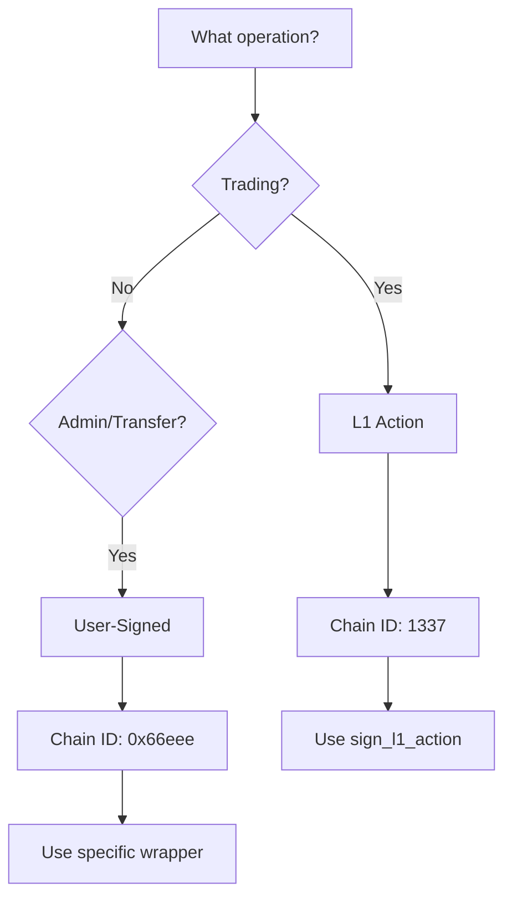

# Hyperliquid: Bridging USDC between HyperCore and HyperEVM

> Learn how to programmatically bridge USDC between HyperCore and HyperEVM. This guide covers system addresses, the CoreWriter contract, token linking requirements, and complete code examples for both directions.

## TLDR

| Direction            | Method                                                                                     |
| -------------------- | ------------------------------------------------------------------------------------------ |
| HyperCore → HyperEVM | `spot_transfer()` to system address `0x2000000000000000000000000000000000000000`           |
| HyperEVM → HyperCore | Approve native USDC to CoreDepositWallet, then call `deposit(amount, 4294967295)` for spot |

## Overview

Hyperliquid operates two interconnected layers:

* **HyperCore** — the high-performance L1 for trading (perps and spot)
* **HyperEVM** — the EVM-compatible layer for smart contracts

Moving USDC between these layers requires understanding the bridging mechanism, system addresses, and token linking. This guide provides complete code examples for both directions.

<Note>
  Connect to a [reliable Hyperliquid RPC endpoint](https://chainstack.com/build-better-with-hyperliquid/) to follow along with the examples.
</Note>

## System addresses

Every token on Hyperliquid has a designated **system address** that serves as the bridge between HyperCore and HyperEVM. The format is:

```
0x20 + zeros + token_index (big-endian)
```

| Token     | Index | System address                               |
| --------- | ----- | -------------------------------------------- |
| USDC      | 0     | `0x2000000000000000000000000000000000000000` |
| HYPE      | N/A   | `0x2222222222222222222222222222222222222222` |
| Token 200 | 200   | `0x20000000000000000000000000000000000000c8` |

<Warning>
  HYPE uses a special system address (`0x2222222222222222222222222222222222222222`) and is received as the native gas token on HyperEVM, not as an ERC20.
</Warning>

## Contract addresses

### Mainnet

| Contract              | Address                                      | Purpose                           |
| --------------------- | -------------------------------------------- | --------------------------------- |
| Native USDC (Circle)  | `0xb88339CB7199b77E23DB6E890353E22632Ba630f` | Standard ERC20 USDC               |
| CoreDepositWallet     | `0x6b9e773128f453f5c2c60935ee2de2cbc5390a24` | Bridge contract (from `spotMeta`) |
| System address (USDC) | `0x2000000000000000000000000000000000000000` | HyperCore → HyperEVM destination  |
| System address (HYPE) | `0x2222222222222222222222222222222222222222` | HYPE bridge                       |
| CoreWriter            | `0x3333333333333333333333333333333333333333` | HyperCore actions from EVM        |

### Testnet

| Contract              | Address                                      | Purpose                           |
| --------------------- | -------------------------------------------- | --------------------------------- |
| Native USDC (Circle)  | `0x2B3370eE501B4a559b57D449569354196457D8Ab` | Standard ERC20 USDC               |
| CoreDepositWallet     | `0x0b80659a4076e9e93c7dbe0f10675a16a3e5c206` | Bridge contract (from `spotMeta`) |
| System address (USDC) | `0x2000000000000000000000000000000000000000` | HyperCore → HyperEVM destination  |

<Warning>
  **Important distinction between the two USDC-related contracts:**

  * **Native USDC** — Circle's standard ERC20 USDC token. Use this for DeFi apps, DEXs, and as the source for bridging.
  * **CoreDepositWallet** — Circle's bridge contract (shown in `spotMeta` as `evmContract.address`). Call `deposit()` on this contract to bridge USDC to HyperCore.

  The CoreDepositWallet is NOT a standard ERC20—do not call `transfer()` on it directly.
</Warning>

<Note>
  You can retrieve the correct linked USDC contract address programmatically using the `spotMeta` API endpoint. The contract address is returned in the `evmContract.address` field.
</Note>

## Endpoint requirements

Different bridging operations require different endpoints:

| Operation                                     | Endpoint      | Provider                    |
| --------------------------------------------- | ------------- | --------------------------- |
| HyperCore → HyperEVM (`spotSend`)             | Info HTTP API | Hyperliquid public RPC only |
| HyperEVM → HyperCore (`transfer`)             | EVM JSON-RPC  | Chainstack or Hyperliquid   |
| Check balances (`spotMeta`, `userState`)      | Info HTTP API | Chainstack or Hyperliquid   |
| Read EVM state (`eth_call`, `eth_getBalance`) | EVM JSON-RPC  | Chainstack or Hyperliquid   |

<Warning>
  Exchange actions like `spotSend` are only available on Hyperliquid's public RPC (`https://api.hyperliquid.xyz` for mainnet). Chainstack endpoints support Info API queries and EVM JSON-RPC but not exchange actions. See [Hyperliquid methods](/docs/hyperliquid-methods) for complete endpoint capabilities.
</Warning>

## Prerequisites

<Steps>
  <Step title="Install dependencies">
    Install the required Python packages:

    ```bash  theme={"system"}
    pip install hyperliquid-python-sdk eth-account web3
    ```
  </Step>

  <Step title="Set up configuration">
    Create a `config.json` file with your credentials:

    ```json  theme={"system"}
    {
      "private_key": "0x...",
      "rpc_endpoint": "YOUR_CHAINSTACK_EVM_ENDPOINT"
    }
    ```
  </Step>

  <Step title="Verify token linking">
    USDC must be linked between HyperCore and HyperEVM. On mainnet, USDC is already linked. On testnet, check [token linking status](#token-linking) before bridging.
  </Step>
</Steps>

## HyperCore to HyperEVM

Transfer USDC from your HyperCore spot account to your HyperEVM wallet using the `spotSend` action directed at the **system address**.

<Warning>
  Exchange actions like `spotSend` require the Hyperliquid public RPC endpoint (`https://api.hyperliquid.xyz` for mainnet). Chainstack endpoints support Info API and EVM JSON-RPC but not exchange actions. See [Hyperliquid methods](/docs/hyperliquid-methods) for endpoint capabilities.
</Warning>

### Using the Python SDK

```python  theme={"system"}
#!/usr/bin/env python3
"""
Bridge USDC from HyperCore to HyperEVM using spotSend to system address
"""

from hyperliquid.exchange import Exchange
from hyperliquid.info import Info
from hyperliquid.utils import constants
from eth_account import Account
import json

# USDC system address (token index 0)
USDC_SYSTEM_ADDRESS = "0x2000000000000000000000000000000000000000"

def bridge_to_evm(amount: float):
    """
    Bridge USDC from HyperCore Spot to HyperEVM.

    The tokens are sent to the system address, and Hyperliquid credits
    them to your HyperEVM address automatically.

    Args:
        amount: Amount of USDC to bridge
    """
    # Load configuration
    with open('config.json') as f:
        config = json.load(f)

    wallet = Account.from_key(config['private_key'])

    print(f"Bridging {amount} USDC from HyperCore to HyperEVM")
    print(f"Wallet: {wallet.address}")
    print(f"Sending to system address: {USDC_SYSTEM_ADDRESS}")

    # Initialize exchange - must use Hyperliquid public endpoint
    exchange = Exchange(
        wallet=wallet,
        base_url=constants.MAINNET_API_URL  # Exchange actions require HL public RPC
    )

    # Check current spot balance
    info = Info(constants.MAINNET_API_URL, skip_ws=True)
    spot_state = info.spot_user_state(wallet.address)
    print(f"\nCurrent spot balances:")
    for b in spot_state.get('balances', []):
        print(f"  {b['coin']}: {b['total']}")

    # spotSend to the USDC system address triggers the bridge
    # Tokens are credited to YOUR address on HyperEVM (the sender)
    result = exchange.spot_transfer(
        amount=amount,
        destination=USDC_SYSTEM_ADDRESS,  # Send to system address
        token="USDC"
    )

    print(f"\nResult: {result}")

    if result.get('status') == 'ok':
        print("✓ Bridge transaction submitted")
        print(f"  {amount} USDC will appear on HyperEVM at {wallet.address}")
    else:
        print(f"✗ Error: {result}")

    return result

if __name__ == "__main__":
    # Bridge 10 USDC to HyperEVM
    bridge_to_evm(amount=10.0)
```

### How it works

1. You send a `spotSend` action with the **system address** (`0x2000000000000000000000000000000000000000`) as the destination
2. Hyperliquid detects this as a bridge request and triggers a system transaction
3. The system transaction calls `transfer(sender_address, amount)` on the linked ERC20 contract
4. USDC appears in **your** HyperEVM wallet (the sender's address)

<Note>
  The bridge is nearly instant—funds typically appear within 2 seconds. The HyperCore → HyperEVM transfer costs approximately 200K gas at the base gas price.
</Note>

## HyperEVM to HyperCore

Transfer USDC from HyperEVM back to HyperCore for trading using the CoreDepositWallet contract.

<Note>
  The linked USDC contract shown in `spotMeta` is a **CoreDepositWallet** contract developed by Circle—not a standard ERC20. To bridge USDC from HyperEVM to HyperCore, you must use the `deposit()` function on this contract after approving the native USDC token.
</Note>

### Understanding the two USDC contracts

Bridging from HyperEVM to HyperCore involves two contracts:

| Contract             | Mainnet                                      | Testnet                                      | Purpose                           |
| -------------------- | -------------------------------------------- | -------------------------------------------- | --------------------------------- |
| Native USDC (Circle) | `0xb88339CB7199b77E23DB6E890353E22632Ba630f` | `0x2B3370eE501B4a559b57D449569354196457D8Ab` | Standard ERC20 USDC               |
| CoreDepositWallet    | `0x6b9e773128f453f5c2c60935ee2de2cbc5390a24` | `0x0b80659a4076e9e93c7dbe0f10675a16a3e5c206` | Bridge contract (from `spotMeta`) |

The CoreDepositWallet address is the `evmContract.address` returned by the `spotMeta` API endpoint.

### Using the CoreDepositWallet

The `deposit()` function signature:

```solidity  theme={"system"}
function deposit(uint256 amount, uint32 destinationDex) external
```

Parameters:

* `amount` — amount in 6 decimals (native USDC decimals)
* `destinationDex` — destination on HyperCore:
  * `0` = perps balance
  * `4294967295` (`type(uint32).max`) = spot balance

```python  theme={"system"}
#!/usr/bin/env python3
"""
Bridge USDC from HyperEVM to HyperCore using CoreDepositWallet
"""

from web3 import Web3
from eth_account import Account
import json

# Contract addresses (mainnet)
NATIVE_USDC = Web3.to_checksum_address("0xb88339CB7199b77E23DB6E890353E22632Ba630f")
CORE_DEPOSIT_WALLET = Web3.to_checksum_address("0x6b9e773128f453f5c2c60935ee2de2cbc5390a24")

# Destination dex values
PERPS_DEX = 0
SPOT_DEX = 4294967295  # type(uint32).max

# ABIs
ERC20_ABI = [
    {
        "inputs": [
            {"name": "spender", "type": "address"},
            {"name": "amount", "type": "uint256"}
        ],
        "name": "approve",
        "outputs": [{"name": "", "type": "bool"}],
        "stateMutability": "nonpayable",
        "type": "function"
    },
    {
        "inputs": [
            {"name": "owner", "type": "address"},
            {"name": "spender", "type": "address"}
        ],
        "name": "allowance",
        "outputs": [{"name": "", "type": "uint256"}],
        "stateMutability": "view",
        "type": "function"
    },
    {
        "inputs": [{"name": "account", "type": "address"}],
        "name": "balanceOf",
        "outputs": [{"name": "", "type": "uint256"}],
        "stateMutability": "view",
        "type": "function"
    }
]

DEPOSIT_ABI = [
    {
        "inputs": [
            {"name": "amount", "type": "uint256"},
            {"name": "destinationDex", "type": "uint32"}
        ],
        "name": "deposit",
        "outputs": [],
        "stateMutability": "nonpayable",
        "type": "function"
    }
]

def bridge_to_core(amount: float, to_spot: bool = True):
    """
    Bridge USDC from HyperEVM to HyperCore.

    Args:
        amount: Amount of USDC to bridge (human-readable, e.g., 10.0)
        to_spot: If True, deposit to Spot balance; otherwise to Perps
    """
    with open('config.json') as f:
        config = json.load(f)

    w3 = Web3(Web3.HTTPProvider(config['rpc_endpoint']))
    wallet = Account.from_key(config['private_key'])
    wallet_address = Web3.to_checksum_address(wallet.address)

    destination = "Spot" if to_spot else "Perps"
    print(f"Bridging {amount} USDC from HyperEVM to HyperCore {destination}")

    # USDC has 6 decimals on HyperEVM
    amount_wei = int(amount * 10**6)

    native_usdc = w3.eth.contract(address=NATIVE_USDC, abi=ERC20_ABI)
    core_deposit = w3.eth.contract(address=CORE_DEPOSIT_WALLET, abi=DEPOSIT_ABI)

    # Check native USDC balance
    balance = native_usdc.functions.balanceOf(wallet_address).call()
    print(f"Native USDC balance: {balance / 10**6}")

    if balance < amount_wei:
        print("Insufficient USDC balance")
        return None

    # Check HYPE for gas
    hype_balance = w3.eth.get_balance(wallet_address)
    if hype_balance == 0:
        print("No HYPE for gas fees")
        return None

    nonce = w3.eth.get_transaction_count(wallet_address)

    # Step 1: Approve if needed
    allowance = native_usdc.functions.allowance(wallet_address, CORE_DEPOSIT_WALLET).call()
    if allowance < amount_wei:
        print(f"Approving {amount} USDC...")
        approve_tx = native_usdc.functions.approve(
            CORE_DEPOSIT_WALLET,
            amount_wei
        ).build_transaction({
            'from': wallet_address,
            'nonce': nonce,
            'gas': 100000,
            'maxFeePerGas': w3.to_wei(0.1, 'gwei'),
            'maxPriorityFeePerGas': w3.to_wei(0.05, 'gwei'),
        })
        signed = w3.eth.account.sign_transaction(approve_tx, config['private_key'])
        tx_hash = w3.eth.send_raw_transaction(signed.raw_transaction)
        w3.eth.wait_for_transaction_receipt(tx_hash)
        nonce += 1
        print("Approval confirmed")

    # Step 2: Deposit to HyperCore
    destination_dex = SPOT_DEX if to_spot else PERPS_DEX
    print(f"Depositing to HyperCore {destination}...")

    deposit_tx = core_deposit.functions.deposit(
        amount_wei,
        destination_dex
    ).build_transaction({
        'from': wallet_address,
        'nonce': nonce,
        'gas': 200000,
        'maxFeePerGas': w3.to_wei(0.1, 'gwei'),
        'maxPriorityFeePerGas': w3.to_wei(0.05, 'gwei'),
    })

    signed = w3.eth.account.sign_transaction(deposit_tx, config['private_key'])
    tx_hash = w3.eth.send_raw_transaction(signed.raw_transaction)
    receipt = w3.eth.wait_for_transaction_receipt(tx_hash)

    if receipt['status'] == 1:
        print(f"Bridge successful! Gas used: {receipt['gasUsed']}")
        print(f"Funds credited to HyperCore {destination}")
    else:
        print("Transaction failed")

    return receipt

if __name__ == "__main__":
    # Bridge 10 USDC to HyperCore Spot
    bridge_to_core(amount=10.0, to_spot=True)
```

<Note>
  The CoreDepositWallet source code is available at [circlefin/hyperevm-circle-contracts](https://github.com/circlefin/hyperevm-circle-contracts/blob/master/src/CoreDepositWallet.sol).
</Note>

### How it works

1. **Approve** the native USDC contract to allow CoreDepositWallet to spend your tokens
2. **Call `deposit()`** on the CoreDepositWallet with:
   * Amount in 6 decimals
   * Destination dex (`0` for perps, `4294967295` for spot)
3. The CoreDepositWallet transfers USDC from your wallet and credits your HyperCore account

<Warning>
  For new HyperCore accounts, a small account creation fee may be deducted from your first deposit.
</Warning>

### Using CoreWriter for spot/perps transfers

Once USDC is on HyperCore (via the direct transfer method above), you can use the **CoreWriter** system contract to transfer between spot and perps accounts:

```python  theme={"system"}
#!/usr/bin/env python3
"""
Transfer USDC between Spot and Perps on HyperCore using CoreWriter
Note: This requires USDC already on HyperCore, not HyperEVM
"""

from web3 import Web3
from eth_account import Account
import json

# CoreWriter system contract address
CORE_WRITER = Web3.to_checksum_address("0x3333333333333333333333333333333333333333")

# CoreWriter ABI (minimal - for usdClassTransfer)
CORE_WRITER_ABI = [
    {
        "inputs": [{"name": "data", "type": "bytes"}],
        "name": "sendRawAction",
        "outputs": [],
        "stateMutability": "nonpayable",
        "type": "function"
    }
]

def transfer_between_spot_perps(amount: float, to_perp: bool = True):
    """
    Transfer USDC between Spot and Perps accounts on HyperCore.

    This uses the CoreWriter contract which emits events processed by HyperCore.

    Args:
        amount: Amount of USDC to transfer
        to_perp: If True, transfer Spot -> Perps; otherwise Perps -> Spot
    """
    with open('config.json') as f:
        config = json.load(f)

    w3 = Web3(Web3.HTTPProvider(config['rpc_endpoint']))
    wallet = Account.from_key(config['private_key'])
    wallet_address = Web3.to_checksum_address(wallet.address)

    direction = "Spot -> Perps" if to_perp else "Perps -> Spot"
    print(f"Transferring {amount} USDC ({direction})")

    # Amount in raw units (USDC has 6 decimals on HyperCore for this action)
    amount_raw = int(amount * 1e6)

    # Encode usdClassTransfer action
    # Action code: 0x010007 for usdClassTransfer
    # Format: action_code (3 bytes) + amount (8 bytes) + toPerp (1 byte) + subAccount (20 bytes, zeros)
    action_code = bytes.fromhex("010007")
    amount_bytes = amount_raw.to_bytes(8, 'big')
    to_perp_byte = b'\x01' if to_perp else b'\x00'
    sub_account = bytes(20)  # Zero address for no subaccount

    data = action_code + amount_bytes + to_perp_byte + sub_account

    core_writer = w3.eth.contract(address=CORE_WRITER, abi=CORE_WRITER_ABI)

    tx = core_writer.functions.sendRawAction(data).build_transaction({
        'from': wallet_address,
        'nonce': w3.eth.get_transaction_count(wallet_address),
        'gas': 100000,
        'maxFeePerGas': w3.to_wei(0.1, 'gwei'),
        'maxPriorityFeePerGas': w3.to_wei(0.05, 'gwei'),
    })

    signed_tx = w3.eth.account.sign_transaction(tx, config['private_key'])
    tx_hash = w3.eth.send_raw_transaction(signed_tx.raw_transaction)

    print(f"Transaction submitted: {tx_hash.hex()}")

    receipt = w3.eth.wait_for_transaction_receipt(tx_hash)

    if receipt['status'] == 1:
        print(f"✓ Transfer submitted to HyperCore")
        print("  Note: CoreWriter does not revert on HyperCore failures")
    else:
        print("✗ EVM transaction failed")

    return receipt

if __name__ == "__main__":
    # Transfer 10 USDC from Spot to Perps
    transfer_between_spot_perps(amount=10.0, to_perp=True)
```

<Warning>
  The CoreWriter contract (`0x3333333333333333333333333333333333333333`) is an event emitter only. It does not revert if the corresponding HyperCore action fails—the EVM transaction will succeed even if the HyperCore action silently fails. Always verify balances after transfers.
</Warning>

<Note>
  For simple spot/perps transfers, you can also use the Python SDK's `usd_class_transfer()` method which handles the encoding automatically. The CoreWriter approach is useful when building smart contracts that need to interact with HyperCore.
</Note>

## Token linking

For custom tokens (not USDC), you must link the HyperEVM ERC20 contract to the HyperCore spot token before bridging works.

### Check if a token is linked

You can use Chainstack's Info HTTP API endpoint for this:

```python  theme={"system"}
from hyperliquid.info import Info
import requests

# Using Chainstack Info HTTP API endpoint
CHAINSTACK_INFO_ENDPOINT = "YOUR_CHAINSTACK_INFO_ENDPOINT"

# Option 1: Using the SDK
info = Info(CHAINSTACK_INFO_ENDPOINT, skip_ws=True)
spot_meta = info.spot_meta()

# Option 2: Direct API call
spot_meta = requests.post(
    f"{CHAINSTACK_INFO_ENDPOINT}/info",
    json={"type": "spotMeta"}
).json()

# Check token linking status
for token in spot_meta.get('tokens', []):
    evm_contract = token.get('evmContract')
    if evm_contract:
        address = evm_contract.get('address') if isinstance(evm_contract, dict) else evm_contract
        print(f"{token['name']}: linked to {address}")
    else:
        print(f"{token['name']}: NOT linked")
```

<Note>
  The `spotMeta` response includes the `evmContract` field for linked tokens. For USDC, you'll see the contract address and `evm_extra_wei_decimals` (typically -2, meaning 6 decimals on EVM vs 8 on HyperCore).
</Note>

### Linking process (for token deployers)

Token linking is a two-step process:

<Steps>
  <Step title="Request EVM contract">
    Send a `RequestEvmContract` action specifying the ERC20 contract address and decimal difference.
  </Step>

  <Step title="Finalize linking">
    Send a `FinalizeEvmContract` action with nonce verification or storage slot validation.
  </Step>
</Steps>

<Warning>
  Only the spot token deployer can link a token. USDC is already linked on mainnet.
</Warning>

## Testnet considerations

<Warning>
  Testnet bridging has specific restrictions that differ from mainnet.
</Warning>

### Net-transfer restriction

On testnet, the net transfer from HyperCore to HyperEVM is capped. If you try to bridge more USDC to HyperEVM than you've previously bridged to HyperCore, the transaction will fail silently.

**Workaround:**

1. First bridge USDC from an external chain (like Arbitrum Sepolia) to HyperCore
2. Then you can bridge that amount to HyperEVM

### New account fees

New HyperCore accounts incur a 1 USDC fee on first deposit:

* Minimum first deposit: >1 USDC + any forwarding fees
* Deposits ≤1 USDC to new accounts fail silently
* Multiple deposits to new accounts in the same block each incur the fee

## Common issues

### "Cannot self-transfer" error

**Cause:** You tried to send tokens to your own address using `spot_transfer()`.

**Solution:** For bridging, send to the **system address** (`0x2000000000000000000000000000000000000000`), not to your own address. Self-transfers to the same user are not allowed.

### "Token not linked" error

**Cause:** The token hasn't been linked between HyperCore and HyperEVM.

**Solution:** For USDC, this shouldn't happen on mainnet. For custom tokens, the token deployer must complete the linking process.

### balanceOf() reverts on CoreDepositWallet

**Cause:** The CoreDepositWallet contract (from `spotMeta`) is not a standard ERC20—it's a bridge contract that doesn't support `balanceOf()` or other ERC20 read functions.

**Solution:** This is expected behavior. To check your USDC balance on HyperEVM, call `balanceOf()` on the **Native USDC** contract (`0xb88339CB7199b77E23DB6E890353E22632Ba630f` on mainnet).

### "Caller is not the system address" error

**Cause:** You tried to call `transfer()` directly on the CoreDepositWallet contract. This contract has access control and does not support standard ERC20 transfers.

**Solution:** Use the `deposit(amount, destinationDex)` function on the CoreDepositWallet instead:

1. First approve your native USDC to the CoreDepositWallet
2. Call `deposit(amount, 4294967295)` for spot balance or `deposit(amount, 0)` for perps

See the [HyperEVM to HyperCore](#hyperevm-to-hypercore) section for complete code examples.

### Silent failure on testnet

**Cause:** Net-transfer restriction or insufficient amount for new account.

**Solution:**

* Ensure you've deposited to HyperCore before trying to bridge to HyperEVM
* For new accounts, deposit >1 USDC

### Transaction succeeds but balance unchanged

**Cause:** Transfer to unlinked token system address or incorrect destination.

**Solution:** Verify the system address matches the token you're bridging.

### "No HYPE for gas" on HyperEVM

**Cause:** HyperEVM uses HYPE as the native gas token, and your wallet has no HYPE.

**Solution:** Bridge some HYPE from HyperCore to HyperEVM first. HYPE uses the special system address `0x2222222222222222222222222222222222222222`.

## Gas costs

| Direction            | Approximate cost            |
| -------------------- | --------------------------- |
| HyperCore → HyperEVM | \~200K gas at base price    |
| HyperEVM → HyperCore | \~100K gas (ERC20 transfer) |

## Best practices

<Check>
  **DO**

  * Use the Python SDK `spot_transfer()` for HyperCore → HyperEVM bridging
  * Use the `CoreDepositWallet.deposit()` function for HyperEVM → HyperCore bridging
  * Approve native USDC to the CoreDepositWallet before calling deposit
  * Verify token linking status before bridging custom tokens
  * Test with small amounts first
  * Check balances on both sides after bridging
</Check>

<Warning>
  **DON'T**

  * Call `transfer()` on the CoreDepositWallet contract (will fail with "Caller is not the system address")
  * Confuse native USDC with the CoreDepositWallet address
  * Bridge amounts ≤1 USDC to new HyperCore accounts
  * Assume testnet behaves identically to mainnet
  * Bridge unlinked tokens (they'll be lost)
</Warning>

## Related resources

* [Hyperliquid methods](/docs/hyperliquid-methods) — Complete list of supported methods and endpoint capabilities
* [Hyperliquid tooling](/docs/hyperliquid-tooling) — SDKs and API reference
* [HyperCore to HyperEVM transfers](https://hyperliquid.gitbook.io/hyperliquid-docs/for-developers/hyperevm/hypercore-less-than-greater-than-hyperevm-transfers) — Official Hyperliquid documentation
* [Circle CCTP documentation](https://developers.circle.com/cctp/cctp-on-hypercore) — Cross-chain USDC transfers
* [Circle HyperEVM contracts](https://github.com/circlefin/hyperevm-circle-contracts) — CoreDepositWallet source code


---

# Understanding Hyperliquid infrastructure and RPC nodes

> Common questions about Hyperliquid's dual-layer architecture, RPC nodes, HyperCore vs HyperEVM, API endpoints, and rate limiting. Understand when to use official APIs versus third-party providers.

This guide addresses common questions about [Hyperliquid's infrastructure](https://chainstack.com/what-is-hyperliquid/), particularly regarding [Hyperliquid RPC nodes](https://chainstack.com/build-better-with-hyperliquid/) and the platform's dual-layer architecture. Understanding these technical foundations is essential for developers building on Hyperliquid.

## Understanding Hyperliquid terminology

Hyperliquid's architecture uses several interchangeable terms that can cause confusion. The platform consists of two distinct execution layers running on a shared consensus mechanism.

The native trading layer—variously called **HyperCore**, Hyperliquid L1, Core, or RustVM—handles all order book operations, perpetuals trading, and margin calculations. Official documentation predominantly uses "HyperCore," while community discussions often reference "Hyperliquid L1." The term "RustVM" emphasizes that this is a custom Rust-based execution environment different from the Ethereum Virtual Machine.

**HyperEVM** refers to the Ethereum-compatible smart contract layer where developers deploy DeFi protocols and other decentralized applications.

<Info>
  A critical distinction: "Hyperliquid L1" carries ambiguity. In some contexts, it refers specifically to HyperCore; in others, it encompasses the entire blockchain system including both HyperCore and HyperEVM.
</Info>

Both layers share HyperBFT consensus and produce interleaved blocks. Rather than operating as separate chains, they function as two distinct virtual machines—one Rust-based, one EVM-compatible—unified under a single consensus layer.

## HyperCore vs HyperEVM

### Architecture and purpose

**HyperCore** serves as the foundation for all trading operations, managing perpetual and spot order books with sub-second latency. This Rust-based layer handles order matching, margin calculations, and position management entirely on-chain without requiring smart contract deployments.

**HyperEVM** operates as an Ethereum-compatible smart contract layer for applications where standard Web3 tooling and composability outweigh the need for microsecond-level performance. Developers can deploy Solidity contracts using familiar tools like Hardhat, Foundry, and Remix.

### API structure

The platform exposes distinct endpoints for each layer. HyperCore operations route through `/info` for queries and `/exchange` for trading actions, while HyperEVM uses the standard `/evm` JSON-RPC endpoint with Chain ID 999.

### Cross-layer integration

HyperEVM contracts access HyperCore data directly through **precompiles**, eliminating the need for external oracles. Smart contracts can read order book prices, user positions, and account balances with zero latency, enabling novel DeFi primitives such as lending protocols that trigger liquidations through HyperCore's native order books rather than external automated market makers.

### When to use each layer

**Trading infrastructure**—including [Hyperliquid trading bots](https://chainstack.com/how-to-build-a-hyperliquid-trading-bot/), market-making systems, and real-time analytics—belongs on HyperCore. The layer's zero gas fees and sub-second execution make it optimal for high-frequency operations requiring direct order book access.

**Smart contract development** naturally fits HyperEVM. Protocols requiring composability with other DeFi applications, complex state management, or compatibility with existing Ethereum tooling should deploy here.

The most sophisticated applications leverage both layers simultaneously. By bridging assets between HyperCore and HyperEVM, developers enable tokens to trade on the order book while maintaining full composability with the broader DeFi ecosystem.

## Why proprietary methods require official Hyperliquid RPC

Third-party RPC providers run non-validator nodes using the official open-source node software from the [hyperliquid-dex/node](https://github.com/hyperliquid-dex/node) GitHub repository. These nodes synchronize blockchain state but do not participate in consensus or order matching. [Chainstack fully supports HyperEVM and a subset of HyperCore query methods](https://chainstack.com/build-better-with-hyperliquid/).

<Warning>
  The `/exchange` endpoint is completely unavailable on non-validator nodes. You must route trading operations through `api.hyperliquid.xyz`, which forwards signed actions to validators for consensus processing.
</Warning>

While the node software includes a `--serve-info` flag to expose local info queries, it provides only a subset of capabilities. The official documentation notes that "historical time series queries and websockets are not currently supported" on self-hosted info servers. Queries requiring real-time order book state like `l2Book` or live trading feeds like `recentTrades` depend on the active matching engine, not replicated blockchain data.

Third-party providers fully support HyperEVM through the `--serve-eth-rpc` flag, offering standard JSON-RPC methods (`eth_call`, `eth_getLogs`, `eth_blockNumber`) with enhanced infrastructure—better uptime, archive access, and geographic distribution. This creates a complementary model: official APIs handle trading operations exclusively, while third-party providers like [Chainstack's Hyperliquid RPC endpoint](https://chainstack.com/hyperliquid-rpc-node/) optimize smart contract access.

## Public infrastructure rate limiting

Hyperliquid's public infrastructure implements multiple overlapping rate limit systems affecting different operation types.

<Note>
  This section summarizes information from the official documentation. In case of discrepancies, refer to the [official Hyperliquid API documentation](https://hyperliquid.gitbook.io/hyperliquid-docs/for-developers/api/rate-limits-and-user-limits).
</Note>

### IP-based limits

Weight is a cost value that represents the computational complexity of each API request. Requests consume weight from your 1200 weight/minute quota.

| Endpoint Type                   | Limit              | Notes                              |
| ------------------------------- | ------------------ | ---------------------------------- |
| REST API (`/info`, `/exchange`) | 1200 weight/min    | See weight table below             |
| HyperEVM (`/evm`)               | 100 req/min        | Basic rate limiting                |
| WebSocket connections           | 100 connections    | Maximum simultaneous connections   |
| WebSocket subscriptions         | 1000 subscriptions | Across all connections             |
| WebSocket unique users          | 10 users           | Across user-specific subscriptions |
| WebSocket messages              | 2000 messages/min  | Messages sent to Hyperliquid       |
| WebSocket inflight posts        | 100 messages       | Simultaneous post messages         |

#### REST API weight calculation

Batching combines multiple operations (e.g., placing 50 orders) into a single API request.

| Request Type                                                                                                                                                                                                                                                  | Base Weight | Additional Weight                                             |
| ------------------------------------------------------------------------------------------------------------------------------------------------------------------------------------------------------------------------------------------------------------- | ----------- | ------------------------------------------------------------- |
| Exchange actions (unbatched)                                                                                                                                                                                                                                  | 1           | `+floor(batch_length / 40)` for batched requests              |
| Info: `l2Book`, `allMids`, `clearinghouseState`, `orderStatus`, `spotClearinghouseState`, `exchangeStatus`                                                                                                                                                    | 2           | —                                                             |
| Info: `userRole`                                                                                                                                                                                                                                              | 60          | —                                                             |
| Info: most other endpoints                                                                                                                                                                                                                                    | 20          | —                                                             |
| Info: `recentTrades`, `historicalOrders`, `userFills`, `userFillsByTime`, `fundingHistory`, `userFunding`, `nonUserFundingUpdates`, `twapHistory`, `userTwapSliceFills`, `userTwapSliceFillsByTime`, `delegatorHistory`, `delegatorRewards`, `validatorStats` | 20          | +1 per 20 items returned                                      |
| Info: `candleSnapshot`                                                                                                                                                                                                                                        | 20          | +1 per 60 items returned                                      |
| Explorer API: blockchain data queries                                                                                                                                                                                                                         | 40          | `blockList`: +1 per block; older blocks weighted more heavily |

### Address-based limits

Address-based limits apply per user, with sub-accounts treated separately. These limits affect only actions, not info requests.

| Limit Type               | Default               | Growth Mechanism                                                                | Maximum      |
| ------------------------ | --------------------- | ------------------------------------------------------------------------------- | ------------ |
| Request quota            | 10,000 initial buffer | +1 per \$1 USDC traded cumulatively                                             | —            |
| Throttled rate           | 1 req/10 seconds      | When quota exhausted                                                            | —            |
| Cancel quota             | Higher than regular   | `min(request_quota + 100000, request_quota * 2)`                                | —            |
| Open orders              | 1,000 orders          | +1 per \$5M volume                                                              | 5,000 orders |
| High congestion throttle | 2x maker percentage   | During high traffic, the system limits users to 2x their maker order proportion | —            |

**Key clarifications:**

* **Batched requests** — count as 1 for IP limits, but `n` for address limits (where `n` = order/cancel count)
* **Reduce-only orders** — orders that only close existing positions
* **Trigger orders** — orders that execute when price conditions are met
* The system rejects orders placed at 1000+ open orders if they are reduce-only or trigger types

### When to upgrade infrastructure

Private RPC becomes necessary for applications requiring over 60 HyperEVM requests per minute, SLA guarantees, multi-user platforms, event indexing, or high-frequency trading. Public infrastructure suits prototyping and educational projects under 100 requests per minute. For testing, you can obtain test tokens through the [Hyperliquid faucet](https://chainstack.com/hyperliquid-faucet/).

<Tip>
  Optimization strategies:

  * Use WebSocket subscriptions for real-time data
  * Batch exchange actions to reduce IP weight consumption
  * Implement local caching
  * Design strategies accounting for address-based limits
  * Avoid resending cancels during high traffic once results are returned

  Private RPC eliminates the 100 requests per minute ceiling while providing dedicated bandwidth and geographic routing.
</Tip>

## Related resources

* [Hyperliquid methods](/docs/hyperliquid-methods) — Complete RPC methods reference showing availability on Chainstack vs public infrastructure
* [Hyperliquid API reference](/reference/hyperliquid-getting-started) — Chainstack API reference for Hyperliquid nodes
* [Hyperliquid node configuration](/docs/hyperliquid-node-configuration) — Understanding system addresses and node flags
* [Hyperliquid tooling](/docs/hyperliquid-tooling) — SDKs and tools for building on Hyperliquid
* [Authentication guide](/docs/hyperliquid-authentication-guide) — Authenticate with the exchange API using signatures


---

# Understanding Hyperliquid infrastructure and RPC nodes

> Common questions about Hyperliquid's dual-layer architecture, RPC nodes, HyperCore vs HyperEVM, API endpoints, and rate limiting. Understand when to use official APIs versus third-party providers.

This guide addresses common questions about [Hyperliquid's infrastructure](https://chainstack.com/what-is-hyperliquid/), particularly regarding [Hyperliquid RPC nodes](https://chainstack.com/build-better-with-hyperliquid/) and the platform's dual-layer architecture. Understanding these technical foundations is essential for developers building on Hyperliquid.

## Understanding Hyperliquid terminology

Hyperliquid's architecture uses several interchangeable terms that can cause confusion. The platform consists of two distinct execution layers running on a shared consensus mechanism.

The native trading layer—variously called **HyperCore**, Hyperliquid L1, Core, or RustVM—handles all order book operations, perpetuals trading, and margin calculations. Official documentation predominantly uses "HyperCore," while community discussions often reference "Hyperliquid L1." The term "RustVM" emphasizes that this is a custom Rust-based execution environment different from the Ethereum Virtual Machine.

**HyperEVM** refers to the Ethereum-compatible smart contract layer where developers deploy DeFi protocols and other decentralized applications.

<Info>
  A critical distinction: "Hyperliquid L1" carries ambiguity. In some contexts, it refers specifically to HyperCore; in others, it encompasses the entire blockchain system including both HyperCore and HyperEVM.
</Info>

Both layers share HyperBFT consensus and produce interleaved blocks. Rather than operating as separate chains, they function as two distinct virtual machines—one Rust-based, one EVM-compatible—unified under a single consensus layer.

## HyperCore vs HyperEVM

### Architecture and purpose

**HyperCore** serves as the foundation for all trading operations, managing perpetual and spot order books with sub-second latency. This Rust-based layer handles order matching, margin calculations, and position management entirely on-chain without requiring smart contract deployments.

**HyperEVM** operates as an Ethereum-compatible smart contract layer for applications where standard Web3 tooling and composability outweigh the need for microsecond-level performance. Developers can deploy Solidity contracts using familiar tools like Hardhat, Foundry, and Remix.

### API structure

The platform exposes distinct endpoints for each layer. HyperCore operations route through `/info` for queries and `/exchange` for trading actions, while HyperEVM uses the standard `/evm` JSON-RPC endpoint with Chain ID 999.

### Cross-layer integration

HyperEVM contracts access HyperCore data directly through **precompiles**, eliminating the need for external oracles. Smart contracts can read order book prices, user positions, and account balances with zero latency, enabling novel DeFi primitives such as lending protocols that trigger liquidations through HyperCore's native order books rather than external automated market makers.

### When to use each layer

**Trading infrastructure**—including [Hyperliquid trading bots](https://chainstack.com/how-to-build-a-hyperliquid-trading-bot/), market-making systems, and real-time analytics—belongs on HyperCore. The layer's zero gas fees and sub-second execution make it optimal for high-frequency operations requiring direct order book access.

**Smart contract development** naturally fits HyperEVM. Protocols requiring composability with other DeFi applications, complex state management, or compatibility with existing Ethereum tooling should deploy here.

The most sophisticated applications leverage both layers simultaneously. By bridging assets between HyperCore and HyperEVM, developers enable tokens to trade on the order book while maintaining full composability with the broader DeFi ecosystem.

## Why proprietary methods require official Hyperliquid RPC

Third-party RPC providers run non-validator nodes using the official open-source node software from the [hyperliquid-dex/node](https://github.com/hyperliquid-dex/node) GitHub repository. These nodes synchronize blockchain state but do not participate in consensus or order matching. [Chainstack fully supports HyperEVM and a subset of HyperCore query methods](https://chainstack.com/build-better-with-hyperliquid/).

<Warning>
  The `/exchange` endpoint is completely unavailable on non-validator nodes. You must route trading operations through `api.hyperliquid.xyz`, which forwards signed actions to validators for consensus processing.
</Warning>

While the node software includes a `--serve-info` flag to expose local info queries, it provides only a subset of capabilities. The official documentation notes that "historical time series queries and websockets are not currently supported" on self-hosted info servers. Queries requiring real-time order book state like `l2Book` or live trading feeds like `recentTrades` depend on the active matching engine, not replicated blockchain data.

Third-party providers fully support HyperEVM through the `--serve-eth-rpc` flag, offering standard JSON-RPC methods (`eth_call`, `eth_getLogs`, `eth_blockNumber`) with enhanced infrastructure—better uptime, archive access, and geographic distribution. This creates a complementary model: official APIs handle trading operations exclusively, while third-party providers like [Chainstack's Hyperliquid RPC endpoint](https://chainstack.com/hyperliquid-rpc-node/) optimize smart contract access.

## Public infrastructure rate limiting

Hyperliquid's public infrastructure implements multiple overlapping rate limit systems affecting different operation types.

<Note>
  This section summarizes information from the official documentation. In case of discrepancies, refer to the [official Hyperliquid API documentation](https://hyperliquid.gitbook.io/hyperliquid-docs/for-developers/api/rate-limits-and-user-limits).
</Note>

### IP-based limits

Weight is a cost value that represents the computational complexity of each API request. Requests consume weight from your 1200 weight/minute quota.

| Endpoint Type                   | Limit              | Notes                              |
| ------------------------------- | ------------------ | ---------------------------------- |
| REST API (`/info`, `/exchange`) | 1200 weight/min    | See weight table below             |
| HyperEVM (`/evm`)               | 100 req/min        | Basic rate limiting                |
| WebSocket connections           | 100 connections    | Maximum simultaneous connections   |
| WebSocket subscriptions         | 1000 subscriptions | Across all connections             |
| WebSocket unique users          | 10 users           | Across user-specific subscriptions |
| WebSocket messages              | 2000 messages/min  | Messages sent to Hyperliquid       |
| WebSocket inflight posts        | 100 messages       | Simultaneous post messages         |

#### REST API weight calculation

Batching combines multiple operations (e.g., placing 50 orders) into a single API request.

| Request Type                                                                                                                                                                                                                                                  | Base Weight | Additional Weight                                             |
| ------------------------------------------------------------------------------------------------------------------------------------------------------------------------------------------------------------------------------------------------------------- | ----------- | ------------------------------------------------------------- |
| Exchange actions (unbatched)                                                                                                                                                                                                                                  | 1           | `+floor(batch_length / 40)` for batched requests              |
| Info: `l2Book`, `allMids`, `clearinghouseState`, `orderStatus`, `spotClearinghouseState`, `exchangeStatus`                                                                                                                                                    | 2           | —                                                             |
| Info: `userRole`                                                                                                                                                                                                                                              | 60          | —                                                             |
| Info: most other endpoints                                                                                                                                                                                                                                    | 20          | —                                                             |
| Info: `recentTrades`, `historicalOrders`, `userFills`, `userFillsByTime`, `fundingHistory`, `userFunding`, `nonUserFundingUpdates`, `twapHistory`, `userTwapSliceFills`, `userTwapSliceFillsByTime`, `delegatorHistory`, `delegatorRewards`, `validatorStats` | 20          | +1 per 20 items returned                                      |
| Info: `candleSnapshot`                                                                                                                                                                                                                                        | 20          | +1 per 60 items returned                                      |
| Explorer API: blockchain data queries                                                                                                                                                                                                                         | 40          | `blockList`: +1 per block; older blocks weighted more heavily |

### Address-based limits

Address-based limits apply per user, with sub-accounts treated separately. These limits affect only actions, not info requests.

| Limit Type               | Default               | Growth Mechanism                                                                | Maximum      |
| ------------------------ | --------------------- | ------------------------------------------------------------------------------- | ------------ |
| Request quota            | 10,000 initial buffer | +1 per \$1 USDC traded cumulatively                                             | —            |
| Throttled rate           | 1 req/10 seconds      | When quota exhausted                                                            | —            |
| Cancel quota             | Higher than regular   | `min(request_quota + 100000, request_quota * 2)`                                | —            |
| Open orders              | 1,000 orders          | +1 per \$5M volume                                                              | 5,000 orders |
| High congestion throttle | 2x maker percentage   | During high traffic, the system limits users to 2x their maker order proportion | —            |

**Key clarifications:**

* **Batched requests** — count as 1 for IP limits, but `n` for address limits (where `n` = order/cancel count)
* **Reduce-only orders** — orders that only close existing positions
* **Trigger orders** — orders that execute when price conditions are met
* The system rejects orders placed at 1000+ open orders if they are reduce-only or trigger types

### When to upgrade infrastructure

Private RPC becomes necessary for applications requiring over 60 HyperEVM requests per minute, SLA guarantees, multi-user platforms, event indexing, or high-frequency trading. Public infrastructure suits prototyping and educational projects under 100 requests per minute. For testing, you can obtain test tokens through the [Hyperliquid faucet](https://chainstack.com/hyperliquid-faucet/).

<Tip>
  Optimization strategies:

  * Use WebSocket subscriptions for real-time data
  * Batch exchange actions to reduce IP weight consumption
  * Implement local caching
  * Design strategies accounting for address-based limits
  * Avoid resending cancels during high traffic once results are returned

  Private RPC eliminates the 100 requests per minute ceiling while providing dedicated bandwidth and geographic routing.
</Tip>

## Related resources

* [Hyperliquid methods](/docs/hyperliquid-methods) — Complete RPC methods reference showing availability on Chainstack vs public infrastructure
* [Hyperliquid API reference](/reference/hyperliquid-getting-started) — Chainstack API reference for Hyperliquid nodes
* [Hyperliquid node configuration](/docs/hyperliquid-node-configuration) — Understanding system addresses and node flags
* [Hyperliquid tooling](/docs/hyperliquid-tooling) — SDKs and tools for building on Hyperliquid
* [Authentication guide](/docs/hyperliquid-authentication-guide) — Authenticate with the exchange API using signatures


---

# Hyperliquid signing overview

> Quick reference guide for the two distinct signing mechanisms in Hyperliquid: L1 actions with phantom agents and user-signed actions for administrative operations.

## Quick reference

Hyperliquid uses two distinct signing mechanisms for different purposes:

| Type            | Chain ID | Domain                       | Purpose            |
| --------------- | -------- | ---------------------------- | ------------------ |
| **L1 Actions**  | 1337     | "Exchange"                   | Trading operations |
| **User-Signed** | 0x66eee  | "HyperliquidSignTransaction" | Admin & transfers  |

## Architecture overview

```
L1 Actions → Phantom Agent → ChainId 1337
                ↑
           Agent Wallet (approved via user-signed)
                ↑
User-Signed → Direct EIP-712 → ChainId 0x66eee
```

## L1 Actions

L1 actions use a **phantom agent** construction for trading operations.

### Characteristics

* **Chain ID**: 1337 (NOT Arbitrum's 42161)
* **Domain name**: "Exchange"
* **Serialization**: Msgpack binary format before hashing
* **Agent construction**: Phantom agent from action hash

### Supported actions

All L1 actions use the same `sign_l1_action()` method:

* `order`, `cancel`, `cancelByCloid`
* `modify`, `batchModify`
* `scheduleCancel`
* `updateLeverage`, `updateIsolatedMargin`
* `vaultTransfer`, `subAccountTransfer`

### Example

```python  theme={"system"}
from hyperliquid.utils.signing import sign_l1_action, get_timestamp_ms

timestamp = get_timestamp_ms()
action = {"type": "order", "orders": [...]}

signature = sign_l1_action(
    wallet,
    action,
    None,  # vault_address
    timestamp,
    None,  # expires_after
    True   # is_mainnet
)
```

## User-Signed actions

User-signed actions use direct EIP-712 signing for administrative operations.

### Characteristics

* **Chain ID**: 0x66eee (421614 in decimal)
* **Domain name**: "HyperliquidSignTransaction"
* **Serialization**: Direct JSON structure
* **No phantom agent**: Direct signing of typed data

### Supported actions

Each action has its own signing wrapper:

* `approveAgent` → `sign_agent()`
* `usdSend` → `sign_usd_transfer_action()`
* `spotSend` → `sign_spot_transfer_action()`
* `withdraw` → `sign_withdraw_from_bridge_action()`
* `approveBuilderFee` → `sign_approve_builder_fee()`
* `usdClassTransfer` → `sign_usd_class_transfer_action()`
* `tokenDelegate` → `sign_token_delegate_action()`

### Example

```python  theme={"system"}
from hyperliquid.exchange import Exchange
from hyperliquid.utils import constants

exchange = Exchange(
    wallet=master_wallet,
    base_url=constants.MAINNET_API_URL
)

# Approve an agent wallet
result, agent_key = exchange.approve_agent("bot_v1")
```

## Key concepts

### Phantom Agent

A cryptographic construct (not a real wallet) for L1 actions:

1. Action serialized with msgpack
2. Nonce and vault address appended
3. Data hashed with keccak256
4. Temporary "agent" object created with hash as connectionId
5. This phantom agent is signed via EIP-712

### Agent Wallet

A separate keypair authorized to sign L1 actions:

* **Stateless**: No funds or positions
* **Nonce isolation**: Independent nonce tracking
* **Limited scope**: Can only sign L1 actions, not transfers
* **Created via**: User-signed `approveAgent` action

## SDK support

<Note>
  The Hyperliquid Python SDK v0.18.0+ handles all signing complexity internally. You don't need to implement the low-level signing logic manually.
</Note>

Connect to a [reliable Hyperliquid RPC endpoint](https://chainstack.com/build-better-with-hyperliquid/) to get started.

### Installation

```bash  theme={"system"}
pip install hyperliquid-python-sdk
```

### Configuration

Create a `config.json` file:

```json  theme={"system"}
{
    "private_key": "0x...",
    "account_address": "0x..."
}
```

## Common pitfalls

<Warning>
  The most common error is using the wrong chain ID. Always use:

  * Chain ID **1337** for L1 actions (trading)
  * Chain ID **0x66eee** for user-signed actions (admin)
    Never use Arbitrum's chain ID (42161) for Hyperliquid signatures.
</Warning>

## Decision flowchart



## Related guides

* [L1 Action signing guide](/docs/hyperliquid-l1-action-signing) — Detailed guide for trading operations

* [User-signed actions guide](/docs/hyperliquid-user-signed-actions) — Complete guide for administrative operations

* [Authentication guide](/docs/hyperliquid-authentication-guide) — Overview of authentication mechanisms


---

# Hyperliquid signing overview

> Quick reference guide for the two distinct signing mechanisms in Hyperliquid: L1 actions with phantom agents and user-signed actions for administrative operations.

## Quick reference

Hyperliquid uses two distinct signing mechanisms for different purposes:

| Type            | Chain ID | Domain                       | Purpose            |
| --------------- | -------- | ---------------------------- | ------------------ |
| **L1 Actions**  | 1337     | "Exchange"                   | Trading operations |
| **User-Signed** | 0x66eee  | "HyperliquidSignTransaction" | Admin & transfers  |

## Architecture overview

```
L1 Actions → Phantom Agent → ChainId 1337
                ↑
           Agent Wallet (approved via user-signed)
                ↑
User-Signed → Direct EIP-712 → ChainId 0x66eee
```

## L1 Actions

L1 actions use a **phantom agent** construction for trading operations.

### Characteristics

* **Chain ID**: 1337 (NOT Arbitrum's 42161)
* **Domain name**: "Exchange"
* **Serialization**: Msgpack binary format before hashing
* **Agent construction**: Phantom agent from action hash

### Supported actions

All L1 actions use the same `sign_l1_action()` method:

* `order`, `cancel`, `cancelByCloid`
* `modify`, `batchModify`
* `scheduleCancel`
* `updateLeverage`, `updateIsolatedMargin`
* `vaultTransfer`, `subAccountTransfer`

### Example

```python  theme={"system"}
from hyperliquid.utils.signing import sign_l1_action, get_timestamp_ms

timestamp = get_timestamp_ms()
action = {"type": "order", "orders": [...]}

signature = sign_l1_action(
    wallet,
    action,
    None,  # vault_address
    timestamp,
    None,  # expires_after
    True   # is_mainnet
)
```

## User-Signed actions

User-signed actions use direct EIP-712 signing for administrative operations.

### Characteristics

* **Chain ID**: 0x66eee (421614 in decimal)
* **Domain name**: "HyperliquidSignTransaction"
* **Serialization**: Direct JSON structure
* **No phantom agent**: Direct signing of typed data

### Supported actions

Each action has its own signing wrapper:

* `approveAgent` → `sign_agent()`
* `usdSend` → `sign_usd_transfer_action()`
* `spotSend` → `sign_spot_transfer_action()`
* `withdraw` → `sign_withdraw_from_bridge_action()`
* `approveBuilderFee` → `sign_approve_builder_fee()`
* `usdClassTransfer` → `sign_usd_class_transfer_action()`
* `tokenDelegate` → `sign_token_delegate_action()`

### Example

```python  theme={"system"}
from hyperliquid.exchange import Exchange
from hyperliquid.utils import constants

exchange = Exchange(
    wallet=master_wallet,
    base_url=constants.MAINNET_API_URL
)

# Approve an agent wallet
result, agent_key = exchange.approve_agent("bot_v1")
```

## Key concepts

### Phantom Agent

A cryptographic construct (not a real wallet) for L1 actions:

1. Action serialized with msgpack
2. Nonce and vault address appended
3. Data hashed with keccak256
4. Temporary "agent" object created with hash as connectionId
5. This phantom agent is signed via EIP-712

### Agent Wallet

A separate keypair authorized to sign L1 actions:

* **Stateless**: No funds or positions
* **Nonce isolation**: Independent nonce tracking
* **Limited scope**: Can only sign L1 actions, not transfers
* **Created via**: User-signed `approveAgent` action

## SDK support

<Note>
  The Hyperliquid Python SDK v0.18.0+ handles all signing complexity internally. You don't need to implement the low-level signing logic manually.
</Note>

Connect to a [reliable Hyperliquid RPC endpoint](https://chainstack.com/build-better-with-hyperliquid/) to get started.

### Installation

```bash  theme={"system"}
pip install hyperliquid-python-sdk
```

### Configuration

Create a `config.json` file:

```json  theme={"system"}
{
    "private_key": "0x...",
    "account_address": "0x..."
}
```

## Common pitfalls

<Warning>
  The most common error is using the wrong chain ID. Always use:

  * Chain ID **1337** for L1 actions (trading)
  * Chain ID **0x66eee** for user-signed actions (admin)
    Never use Arbitrum's chain ID (42161) for Hyperliquid signatures.
</Warning>

## Decision flowchart


## Related guides

* [L1 Action signing guide](/docs/hyperliquid-l1-action-signing) — Detailed guide for trading operations

* [User-signed actions guide](/docs/hyperliquid-user-signed-actions) — Complete guide for administrative operations

* [Authentication guide](/docs/hyperliquid-authentication-guide) — Overview of authentication mechanisms


---

# Hyperliquid signing overview

> Quick reference guide for the two distinct signing mechanisms in Hyperliquid: L1 actions with phantom agents and user-signed actions for administrative operations.

## Quick reference

Hyperliquid uses two distinct signing mechanisms for different purposes:

| Type            | Chain ID | Domain                       | Purpose            |
| --------------- | -------- | ---------------------------- | ------------------ |
| **L1 Actions**  | 1337     | "Exchange"                   | Trading operations |
| **User-Signed** | 0x66eee  | "HyperliquidSignTransaction" | Admin & transfers  |

## Architecture overview

```
L1 Actions → Phantom Agent → ChainId 1337
                ↑
           Agent Wallet (approved via user-signed)
                ↑
User-Signed → Direct EIP-712 → ChainId 0x66eee
```

## L1 Actions

L1 actions use a **phantom agent** construction for trading operations.

### Characteristics

* **Chain ID**: 1337 (NOT Arbitrum's 42161)
* **Domain name**: "Exchange"
* **Serialization**: Msgpack binary format before hashing
* **Agent construction**: Phantom agent from action hash

### Supported actions

All L1 actions use the same `sign_l1_action()` method:

* `order`, `cancel`, `cancelByCloid`
* `modify`, `batchModify`
* `scheduleCancel`
* `updateLeverage`, `updateIsolatedMargin`
* `vaultTransfer`, `subAccountTransfer`

### Example

```python  theme={"system"}
from hyperliquid.utils.signing import sign_l1_action, get_timestamp_ms

timestamp = get_timestamp_ms()
action = {"type": "order", "orders": [...]}

signature = sign_l1_action(
    wallet,
    action,
    None,  # vault_address
    timestamp,
    None,  # expires_after
    True   # is_mainnet
)
```

## User-Signed actions

User-signed actions use direct EIP-712 signing for administrative operations.

### Characteristics

* **Chain ID**: 0x66eee (421614 in decimal)
* **Domain name**: "HyperliquidSignTransaction"
* **Serialization**: Direct JSON structure
* **No phantom agent**: Direct signing of typed data

### Supported actions

Each action has its own signing wrapper:

* `approveAgent` → `sign_agent()`
* `usdSend` → `sign_usd_transfer_action()`
* `spotSend` → `sign_spot_transfer_action()`
* `withdraw` → `sign_withdraw_from_bridge_action()`
* `approveBuilderFee` → `sign_approve_builder_fee()`
* `usdClassTransfer` → `sign_usd_class_transfer_action()`
* `tokenDelegate` → `sign_token_delegate_action()`

### Example

```python  theme={"system"}
from hyperliquid.exchange import Exchange
from hyperliquid.utils import constants

exchange = Exchange(
    wallet=master_wallet,
    base_url=constants.MAINNET_API_URL
)

# Approve an agent wallet
result, agent_key = exchange.approve_agent("bot_v1")
```

## Key concepts

### Phantom Agent

A cryptographic construct (not a real wallet) for L1 actions:

1. Action serialized with msgpack
2. Nonce and vault address appended
3. Data hashed with keccak256
4. Temporary "agent" object created with hash as connectionId
5. This phantom agent is signed via EIP-712

### Agent Wallet

A separate keypair authorized to sign L1 actions:

* **Stateless**: No funds or positions
* **Nonce isolation**: Independent nonce tracking
* **Limited scope**: Can only sign L1 actions, not transfers
* **Created via**: User-signed `approveAgent` action

## SDK support

<Note>
  The Hyperliquid Python SDK v0.18.0+ handles all signing complexity internally. You don't need to implement the low-level signing logic manually.
</Note>

Connect to a [reliable Hyperliquid RPC endpoint](https://chainstack.com/build-better-with-hyperliquid/) to get started.

### Installation

```bash  theme={"system"}
pip install hyperliquid-python-sdk
```

### Configuration

Create a `config.json` file:

```json  theme={"system"}
{
    "private_key": "0x...",
    "account_address": "0x..."
}
```

## Common pitfalls

<Warning>
  The most common error is using the wrong chain ID. Always use:

  * Chain ID **1337** for L1 actions (trading)
  * Chain ID **0x66eee** for user-signed actions (admin)
    Never use Arbitrum's chain ID (42161) for Hyperliquid signatures.
</Warning>

## Decision flowchart


## Related guides

* [L1 Action signing guide](/docs/hyperliquid-l1-action-signing) — Detailed guide for trading operations

* [User-signed actions guide](/docs/hyperliquid-user-signed-actions) — Complete guide for administrative operations

* [Authentication guide](/docs/hyperliquid-authentication-guide) — Overview of authentication mechanisms


---

# Hyperliquid: Debugging signature errors

> Troubleshoot common Hyperliquid authentication failures including 'User or API Wallet does not exist', chainId mismatches in browser wallets, and TypeScript SDK integration issues.

## Overview

Signature errors on Hyperliquid often produce cryptic messages that don't point to the actual cause. This guide covers the most common issues developers encounter, based on real problems reported in the Hyperliquid developer community.

<Note>
  For foundational signing concepts, see the [authentication guide](/docs/hyperliquid-authentication-guide) and [signing overview](/docs/hyperliquid-signing-overview).
</Note>

## "User or API Wallet does not exist" with changing addresses

This error is one of the most confusing because the wallet address in the error message changes with every request:

```
L1 error: User or API Wallet 0xABC123... does not exist.
L1 error: User or API Wallet 0xDEF456... does not exist.  // Different address!
```

### Why the address changes

The address isn't random—it's the **recovered address** from your signature. Hyperliquid uses ECDSA signature recovery to determine who signed the message. When your signature is malformed, the recovery produces a different (invalid) address each time.

### Root causes

<Accordion title="Key ordering in action objects">
  The action hash depends on msgpack serialization, which is **order-sensitive**. Different key orders produce different hashes, leading to different recovered addresses.

  ```python  theme={"system"}
  # WRONG - unpredictable key order in Python dict
  action = {"sz": "0.001", "coin": "BTC", "is_buy": True}

  # CORRECT - use SDK helper functions that ensure consistent ordering
  from hyperliquid.utils.signing import order_request_to_order_wire
  action = order_request_to_order_wire(order_request)
  ```

  ```typescript  theme={"system"}
  // WRONG - object property order can vary
  const action = { sz: "0.001", coin: "BTC", isBuy: true };

  // CORRECT - use SDK methods that handle ordering
  const result = await client.order({
    orders: [{ a: 0, b: true, p: "50000", s: "0.001", r: false, t: { limit: { tif: "Gtc" } } }],
    grouping: "na"
  });
  ```
</Accordion>

<Accordion title="Address case sensitivity">
  Hyperliquid requires lowercase addresses for signature verification:

  ```python  theme={"system"}
  # WRONG - mixed case
  agent_address = "0xAbCdEf1234567890AbCdEf1234567890AbCdEf12"

  # CORRECT - lowercase
  agent_address = "0xabcdef1234567890abcdef1234567890abcdef12"
  ```

  <Warning>
    Always lowercase addresses before signing. The SDK does this automatically, but manual implementations must handle it explicitly.
  </Warning>
</Accordion>

<Accordion title="Agent wallet not approved">
  If you're using an agent wallet that hasn't been approved by the master account, signature recovery fails:

  ```python  theme={"system"}
  from hyperliquid.info import Info
  from hyperliquid.utils import constants

  info = Info(constants.MAINNET_API_URL, skip_ws=True)
  state = info.user_state("0x_YOUR_MASTER_ADDRESS")

  # Check approved agents
  print(state.get("agentAddresses", []))
  ```

  If your agent isn't listed, approve it first:

  ```python  theme={"system"}
  result, agent_key = exchange.approve_agent("my_bot")
  ```
</Accordion>

<Accordion title="Account has no funds">
  Even with a valid signature, the error appears if the master account has zero balance:

  ```python  theme={"system"}
  # Verify account has collateral
  state = info.user_state("0x_YOUR_ADDRESS")
  print(f"Margin summary: {state.get('marginSummary', {})}")
  ```

  Deposit USDC before attempting trades.
</Accordion>

### Debugging checklist

<Steps>
  <Step title="Log the exact action object">
    Print the action just before signing to verify structure and key order
  </Step>

  <Step title="Verify address formatting">
    Ensure all addresses are lowercase with `0x` prefix
  </Step>

  <Step title="Check agent approval">
    Query `user_state` to confirm agent is in `agentAddresses` list
  </Step>

  <Step title="Verify account balance">
    Confirm the master account has collateral deposited
  </Step>

  <Step title="Compare with SDK output">
    Run the equivalent SDK method and compare the generated signature
  </Step>
</Steps>

## chainId mismatch in browser wallets

When integrating with viem or wagmi, you may encounter:

```
ChainMismatchError: Provided chainId '1337' must match the active chainId '42161'
```

Or from MetaMask:

```
Provided chainId "1337" must match the active chainId "10"
```

### Why this happens

Hyperliquid L1 actions require signing with **chainId 1337**, but your wallet is connected to Arbitrum (42161), Optimism (10), or another chain. Browser wallets enforce that the signing chain matches the connected chain.

### Solutions

<Tabs>
  <Tab title="Use agent wallets (recommended)">
    Create an agent wallet for trading operations. The agent signs server-side with chainId 1337, avoiding the browser mismatch entirely:

    ```typescript  theme={"system"}
    import { ExchangeClient, HttpTransport } from "@nktkas/hyperliquid";
    import { PrivateKeySigner } from "@nktkas/hyperliquid/signing";

    // Agent wallet signs with chainId 1337 automatically
    const agentSigner = new PrivateKeySigner({ privateKey: AGENT_PRIVATE_KEY });
    const client = new ExchangeClient({
      transport: new HttpTransport(),
      wallet: agentSigner
    });

    // User's browser wallet only signs approveAgent (chainId 0x66eee)
    // which matches Arbitrum, so no mismatch
    ```
  </Tab>

  <Tab title="Custom chain definition">
    Define a custom chain for Hyperliquid signing:

    ```typescript  theme={"system"}
    import { createWalletClient, custom } from "viem";

    const hyperliquidL1 = {
      id: 1337,
      name: "Hyperliquid L1",
      nativeCurrency: { name: "USD", symbol: "USD", decimals: 18 },
      rpcUrls: {
        default: { http: ["https://api.hyperliquid.xyz"] }
      }
    } as const;

    const walletClient = createWalletClient({
      chain: hyperliquidL1,
      transport: custom(window.ethereum)
    });
    ```

    <Warning>
      This approach shows users unreadable hex data when signing. Not recommended for production frontends where user trust matters.
    </Warning>
  </Tab>

  <Tab title="Sign with local account">
    Use a local viem account that doesn't enforce chain matching:

    ```typescript  theme={"system"}
    import { privateKeyToAccount } from "viem/accounts";
    import { ExchangeClient, HttpTransport } from "@nktkas/hyperliquid";

    // Local accounts don't enforce chainId matching
    const account = privateKeyToAccount(PRIVATE_KEY);
    const client = new ExchangeClient({ transport: new HttpTransport(), wallet: account });
    ```
  </Tab>
</Tabs>

### Best practice for frontends

For production applications, use this two-wallet pattern:

1. **Browser wallet** (user's MetaMask/WalletConnect) — signs `approveAgent` (chainId 0x66eee matches Arbitrum)
2. **Agent wallet** (generated keypair stored locally) — signs all L1 actions (chainId 1337)

```typescript  theme={"system"}
import { ExchangeClient, HttpTransport } from "@nktkas/hyperliquid";
import { PrivateKeySigner } from "@nktkas/hyperliquid/signing";

// First: user approves agent via browser wallet (one-time)
const agentAddress = await approveAgentWithBrowserWallet();

// Then: agent handles all trading
const agentClient = new ExchangeClient({
  transport: new HttpTransport(),
  wallet: new PrivateKeySigner({ privateKey: agentPrivateKey })
});

// No chainId conflicts because browser wallet never signs L1 actions
```

## TypeScript SDK options

Hyperliquid has two community TypeScript SDKs:

| SDK                                                           | Maintainer | Features                                                 |
| ------------------------------------------------------------- | ---------- | -------------------------------------------------------- |
| [@nktkas/hyperliquid](https://github.com/nktkas/hyperliquid)  | nktkas     | Full API coverage, PrivateKeySigner, viem/ethers support |
| [nomeida/hyperliquid](https://github.com/nomeida/hyperliquid) | nomeida    | Simpler API, good for quick integrations                 |

### @nktkas/hyperliquid examples

Install:

```bash  theme={"system"}
npm install @nktkas/hyperliquid viem
```

<CodeGroup>
  ```typescript With viem theme={"system"}
  import { ExchangeClient, HttpTransport } from "@nktkas/hyperliquid";
  import { privateKeyToAccount } from "viem/accounts";

  const account = privateKeyToAccount("0xac0974bec39a17e36ba4a6b4d238ff944bacb478cbed5efcae784d7bf4f2ff80");
  const client = new ExchangeClient({
    transport: new HttpTransport(),
    wallet: account
  });

  const result = await client.order({
    orders: [{
      a: 0,  // Asset index (0 = BTC)
      b: true,  // is_buy
      p: "50000",  // price
      s: "0.001",  // size
      r: false,  // reduce_only
      t: { limit: { tif: "Gtc" } }
    }],
    grouping: "na"
  });
  ```

  ```typescript With PrivateKeySigner (no viem dependency) theme={"system"}
  import { ExchangeClient, HttpTransport } from "@nktkas/hyperliquid";
  import { PrivateKeySigner } from "@nktkas/hyperliquid/signing";

  const signer = new PrivateKeySigner({ privateKey: "0xac0974bec39a17e36ba4a6b4d238ff944bacb478cbed5efcae784d7bf4f2ff80" });
  const client = new ExchangeClient({
    transport: new HttpTransport(),
    wallet: signer
  });

  // Same API as with viem
  const result = await client.order({...});
  ```

  ```typescript Manual signing for custom wallets theme={"system"}
  import { signL1Action } from "@nktkas/hyperliquid/signing";

  // For hardware wallets, MPC, or other custom signers
  const signature = await signL1Action({
    wallet: myCustomWallet,  // Must implement signTypedData
    action: orderAction,
    nonce: Date.now(),
    isTestnet: false
  });

  // Submit manually
  const response = await fetch("https://api.hyperliquid.xyz/exchange", {
    method: "POST",
    headers: { "Content-Type": "application/json" },
    body: JSON.stringify({
      action: orderAction,
      nonce: signature.nonce,
      signature: signature.signature,
      vaultAddress: null
    })
  });
  ```
</CodeGroup>

## reserveRequestWeight for HIP-3 builders

If you're building a HIP-3 DEX and need to push oracle prices, you'll encounter `reserveRequestWeight`—an action that uses a unique hybrid signing pattern.

### The edge case

Most actions follow clear rules:

* L1 actions → phantom agent schema, signed by agent wallet
* User-signed actions → direct EIP-712, signed by user wallet

`reserveRequestWeight` breaks this pattern: it uses the **agent-style schema** but must be signed by the **user wallet**.

<Note>
  This hybrid exists because oracle updates need the authority of the main account but use the same submission path as L1 actions.
</Note>

### Implementation

```python  theme={"system"}
# The SDK handles this internally for HIP-3 operations
# If implementing manually, use phantom agent construction
# but sign with the user's wallet (not an agent wallet)

action = {
    "type": "reserveRequestWeight",
    "asset": 110000,  # HIP-3 asset index
    "weight": 1000
}

# Uses phantom agent hash BUT requires user wallet signature
signature = sign_l1_action(
    user_wallet,  # NOT agent_wallet
    action,
    None,
    timestamp,
    None,
    True
)
```

## Error reference

| Error message                       | Likely cause                  | Solution                                                         |
| ----------------------------------- | ----------------------------- | ---------------------------------------------------------------- |
| "User or API Wallet does not exist" | Signature recovery failed     | Check key ordering, address case, agent approval                 |
| "Invalid signature"                 | Wrong signing scheme          | L1 actions: chainId 1337; user-signed: chainId 0x66eee           |
| "Provided chainId must match"       | Browser wallet chain mismatch | Use agent wallet for L1 actions                                  |
| "Invalid or expired nonce"          | Nonce not in milliseconds     | Use `get_timestamp_ms()` or `Date.now()`                         |
| "Failed to deserialize"             | Missing required fields       | Ensure all required fields present (e.g., `grouping` for orders) |
| "Agent not approved"                | Agent wallet not authorized   | Call `approve_agent()` first                                     |
| "Agent already exists"              | Duplicate agent name          | Use unique names per agent                                       |

## Summary

Most Hyperliquid signature errors fall into three categories:

1. **Serialization issues** — Key ordering, address casing, missing fields
2. **Chain ID confusion** — Using wrong chainId for L1 vs user-signed actions
3. **Wallet configuration** — Agent not approved, no funds, wrong wallet type

When debugging, always start by comparing your implementation against the SDK's output—it handles all the edge cases correctly.

## Related resources

* [Authentication guide](/docs/hyperliquid-authentication-guide) — Overview of both signing mechanisms
* [L1 action signing](/docs/hyperliquid-l1-action-signing) — Phantom agent construction details
* [User-signed actions](/docs/hyperliquid-user-signed-actions) — Agent approval and transfers
* [Hyperliquid API reference](/reference/hyperliquid-getting-started) — Complete endpoint documentation


---

# Hyperliquid node configuration and system transactions

> Understand Hyperliquid system addresses, how the hl-node-compliant flag affects transaction visibility, and availability on Chainstack.

<Note>
  System transactions are only available on [Dedicated Nodes](/docs/dedicated-node) with custom configuration.
</Note>

## System addresses and transactions

System addresses in Hyperliquid facilitate token bridging between HyperCore and HyperEVM. They follow a specific format:

* First byte: `0x20`
* Remaining bytes: zeros with token index in big-endian format
* HYPE token: `0x2222222222222222222222222222222222222222`

Example for token index 200:

```
0x20000000000000000000000000000000000000c8
```

On HyperEVM, these system transactions are recorded as pseudo-transactions to simplify the implementation of tools that need to track these, like block explorers.

See Hyperliquid docs: [HyperCore ↔ HyperEVM transfers](https://hyperliquid.gitbook.io/hyperliquid-docs/for-developers/hyperevm/hypercore-less-than-greater-than-hyperevm-transfers) and [nanoreth README](https://github.com/hl-archive-node/nanoreth).

## Node configuration

### Default nodes (hl-node compliant)

Chainstack Hyperliquid nodes run with the nanoreth `--hl-node-compliant` flag by default:

* System transactions are **excluded** from output
* Provides cleaner transaction data similar to the default (non-nanoreth) Hyperliquid node operation.

### Dedicated nodes (system transaction support)

For applications requiring cross-layer transfer tracking, request a dedicated node without the `--hl-node-compliant` flag.

## Requesting system transaction support

Request a Hyperliquid [Dedicated Node](/docs/dedicated-node) deployment or connect to a [reliable Hyperliquid RPC endpoint](https://chainstack.com/build-better-with-hyperliquid/) for standard operations.


---

# Building a copy trading bot with spot order mirroring

> Learn how to build a copy trading bot that mirrors spot trades in real-time using WebSocket subscriptions.

Copy trading on Hyperliquid requires more than just watching orders—you need proper state management, event sequencing, and dynamic order sizing. This guide shows you how to build a copy trading bot that mirrors spot trades in real-time.

<Info>
  **Prerequisites**

  * Python 3.8 or higher
  * `hyperliquid-python-sdk` installed (`pip install hyperliquid-python-sdk`)
  * [Reliable Hyperliquid RPC endpoint](https://chainstack.com/build-better-with-hyperliquid/) ([sign up for free](https://console.chainstack.com/))
</Info>

## Understanding Hyperliquid's WebSocket architecture

Hyperliquid provides two essential WebSocket channels for monitoring trading activity. These channels serve different purposes:

**`orderUpdates`** delivers `WsOrder[]` events containing order status changes—when orders are placed, modified, or canceled. This is your primary signal for mirroring trading decisions.

**`userEvents`** provides `WsUserEvent` data including fills, funding payments, and liquidations. For this tutorial, the most important part is that the channel provides TWAP order updates not available in `orderUpdates`.

Together, these channels give you a complete picture of a trader's activity:

```python  theme={"system"}
order_subscription = {
    "method": "subscribe",
    "subscription": {"type": "orderUpdates", "user": LEADER_ADDRESS}
}

events_subscription = {
    "method": "subscribe",
    "subscription": {"type": "userEvents", "user": LEADER_ADDRESS}
}

await websocket.send(json.dumps(order_subscription))
await websocket.send(json.dumps(events_subscription))
```

## How spot markets work on Hyperliquid

Before diving into implementation, you need to understand how Hyperliquid distinguishes spot from perpetual assets. The `coin` field format tells you the market type:

**Perpetual contracts** use simple asset names returned from the `meta` endpoint:

* `BTC` — Bitcoin perpetual
* `ETH` — Ethereum perpetual
* `SOL` — Solana perpetual

**Spot markets** use two formats:

* `@{index}` — numeric spot pair index (for example, `@0` for BTC/USDC, `@107` for HYPE/USDC)
* `{TOKEN}/USDC` — human-readable pair names (for example, `PURR/USDC`)

Why the `@index` format? It's Hyperliquid's internal representation—more efficient for the order book engine. When you receive WebSocket events, the `coin` field typically contains the `@index` format for spot trades.

This matters for copy trading because:

1. You receive `@123` in WebSocket events
2. You need to query metadata using that index
3. You place orders using the same `@index` format

The index maps to token metadata through the `spotMeta` endpoint, which provides crucial information like price precision and size decimals.

## Detecting spot vs perpetual orders

Your bot monitors a trader who trades both spot and perps. Spot orders are cash trades (you own the asset), perps involve leverage and funding payments. For simplicity, you might want to mirror only spot trades initially.

The `coin` field in WebSocket events tells you the market type:

```python  theme={"system"}
def detect_market_type(coin_field):
    if coin_field.startswith("@"):
        return "SPOT"  # "@123" = spot index format
    elif "/" in coin_field:
        return "SPOT"  # "PURR/USDC" = spot pair name
    else:
        return "PERP"  # "BTC", "ETH" = perpetual contracts
```

This logic follows Hyperliquid's naming convention: if the coin starts with `@` or contains `/`, it's a spot market. Otherwise, it's a perpetual contract.

Filter to spot-only mirroring:

```python  theme={"system"}
def is_spot_order(coin_field):
    return detect_market_type(coin_field) == "SPOT"

# In your event handler
if not is_spot_order(coin_field):
    continue  # Skip perp orders
```

## Dynamic order sizing for spot assets

A leader might trade \$10,000 of BTC, but your bot has a \$1,000 budget. You need proportional sizing based on your capital allocation. But it's not just about scaling down—Hyperliquid enforces strict precision rules.

According to the [official documentation](https://hyperliquid.gitbook.io/hyperliquid-docs/for-developers/api/exchange-endpoint#order-limits):

**Size precision** — Round to the asset's `szDecimals` (found in `meta` response):

* `szDecimals = 3`: `1.001` valid, `1.0001` invalid
* `szDecimals = 1`: `0.1` valid, `0.01` invalid

**Price precision** — Max 5 significant figures, no more than `MAX_DECIMALS - szDecimals` decimal places (spot: `MAX_DECIMALS = 8`, perps: `MAX_DECIMALS = 6`):

* `szDecimals = 0`: `0.0001234` valid (8 decimals)
* `szDecimals = 2`: `0.0001234` invalid (exceeds 8-2=6 decimals)
* `1234.5` valid, `1234.56` invalid (too many sig figs)

Query metadata and calculate valid sizes:

```python  theme={"system"}
async def get_spot_asset_info(info: Info, coin_field: str) -> Optional[dict]:
    """Get real-time price and size decimals for proper order sizing"""
    spot_data = info.spot_meta_and_asset_ctxs()
    spot_meta = spot_data[0]
    asset_ctxs = spot_data[1]

    index = int(coin_field[1:])  # "@123" -> 123
    ctx = asset_ctxs[index]
    price = float(ctx.get("midPx", ctx.get("markPx", 0)))

    pair_info = next(p for p in spot_meta["universe"] if p["index"] == index)
    token_info = spot_meta["tokens"][pair_info["tokens"][0]]

    return {
        "price": price,
        "szDecimals": token_info.get("szDecimals", 6),
        "coin": coin_field
    }

# Calculate and round order size
asset_info = await get_spot_asset_info(info, "@0")
follower_size = round(
    FIXED_ORDER_VALUE_USDC / asset_info["price"],
    asset_info["szDecimals"]
)
```

**Example**: \$15 / \$65,000 BTC with `szDecimals = 5` → `0.00023076923...` rounds to `0.00023`.

## Understanding order lifecycle and state transitions

Orders on Hyperliquid go through a lifecycle with specific state transitions. When you subscribe to `orderUpdates`, you receive events for each state change.

### Order state events explained

**`open` status** — A new order has been placed on the book by the leader.

**`canceled` status** — Order removed from the book, either by:

* Trader manually canceling
* Part of a modification (old order canceled, new order created with different ID)
* System cancellation (insufficient balance, delisting, etc.)

**`filled` status** — Order fully executed. You'll also see detailed fill information in the `userEvents` channel.

### How order modifications work

When a trader modifies an order on Hyperliquid (changes price or size), the exchange handles this atomically as:

1. Cancel the existing order (you receive `"canceled"` event)
2. Create a new order with the new parameters (you receive `"open"` event with **new order ID**)

This means you don't need special modification logic—simply handle cancellations and new orders:

```python  theme={"system"}
async def handle_leader_order_events(data: dict, exchange: Exchange, info: Info):
    """Process order lifecycle events from leader"""

    for order_update in data.get("data", []):
        order = order_update.get("order", {})
        status = order_update.get("status")
        leader_order_id = order.get("oid")
        coin_field = order.get("coin", "")

        # Skip non-spot orders
        if not is_spot_order(coin_field):
            continue

        if status == "open":
            # New order placed - mirror it
            follower_order_id = await place_follower_order(exchange, info, order)
            if follower_order_id:
                # Store mapping for future cancellations
                order_mappings[leader_order_id] = follower_order_id

        elif status == "canceled" and leader_order_id in order_mappings:
            # Leader canceled an order - cancel our follower order
            follower_order_id = order_mappings[leader_order_id]
            await cancel_follower_order(exchange, follower_order_id, coin_field)
            # Remove from mapping - this order is no longer active
            del order_mappings[leader_order_id]
```

The `order_mappings` dictionary tracks active orders by mapping each leader order ID to your corresponding follower order ID. This allows you to cancel the correct follower order when the leader cancels

## Placing orders with the Hyperliquid SDK

The [hyperliquid-python-sdk](https://github.com/hyperliquid-dex/hyperliquid-python-sdk) provides the `exchange.order()` method for placing trades. Let's break down each parameter and why it matters:

```python  theme={"system"}
result = exchange.order(
    name=coin_field,        # "@0" for BTC/USDC - must match WebSocket coin format
    is_buy=True,            # True for buy, False for sell
    sz=order_size,          # Calculated with proper precision from metadata
    limit_px=price,         # Limit price - protects against slippage
    order_type=HLOrderType({"limit": {"tif": "Gtc"}}),  # Good-til-canceled
    reduce_only=False       # False = can open new positions
)
```

The response structure tells you whether your order was accepted:

```python  theme={"system"}
if result.get("status") == "ok":
    statuses = result["response"]["data"]["statuses"]
    status_info = statuses[0]

    if "resting" in status_info:
        # Order placed on the book, waiting to fill
        follower_order_id = status_info["resting"]["oid"]
        return follower_order_id
    elif "filled" in status_info:
        # Order executed immediately (market was liquid enough)
        follower_order_id = status_info["filled"]["oid"]
        return follower_order_id
```

Why check both `resting` and `filled`? If you place a limit buy at \$100 and the best ask is \$99, your order fills immediately. You still need the order ID for tracking fills and state management.

<Check>
  Order successfully placed and order ID received for tracking
</Check>

## Testing with same wallet (development only)

<Warning>
  This section describes a **development shortcut** for testing. In production, you'll use separate leader and follower wallets, and this infinite loop problem won't exist.
</Warning>

When building your bot, you probably don't want to manage two separate wallets and fund both with testnet USDC. For testing purposes, you can use the same wallet as both leader and follower—but this creates a challenge.

**The infinite loop problem**:

<Steps>
  <Step title="Leader places order">
    The leader wallet (your test wallet) initiates a new order
  </Step>

  <Step title="Bot mirrors it as follower">
    Your bot detects the order and places a mirror order using the same wallet
  </Step>

  <Step title="Bot sees its own follower order">
    WebSocket receives the follower order as a "new leader order" (because you're watching the same wallet)
  </Step>

  <Step title="Bot tries to mirror again">
    Bot attempts to mirror the follower order, creating another order
  </Step>

  <Step title="Infinite loop">
    Process repeats indefinitely, placing unlimited orders
  </Step>
</Steps>

**The solution**: Track which orders are follower-placed and skip them:

```python  theme={"system"}
order_mappings: Dict[int, int] = {}  # leader_order_id -> follower_order_id

# In event handler
if leader_order_id in order_mappings.values():
    # This order ID is a follower order we placed - skip it
    print(f"Skipping follower order {leader_order_id}")
    continue
```

When you mirror a leader order, you store the mapping `{leader_order_id: follower_order_id}`. Later, when that follower order appears in the WebSocket feed (because you're watching your own wallet), you check: "Is this order ID in my follower list?" If yes, ignore it.

**Important**: In production with separate wallets, leader and follower order IDs never overlap—you don't need this check. This is purely for development convenience.

## Sequential processing (simplified for testing)

<Note>
  This section describes a **simplified architecture for testing**. In production with high-frequency trading, you'd process events in parallel with proper concurrency controls.
</Note>

When WebSocket messages arrive, you have two architectural choices:

**Concurrent processing** (production):

* Process multiple order events simultaneously
* Requires locks/semaphores to prevent race conditions
* Optimal for high-frequency traders placing hundreds of orders per minute
* More complex to implement and debug

**Sequential processing** (testing/development):

* Process one order event at a time
* No race conditions by design
* Simple to implement and reason about
* Sufficient for mirroring human traders (10-100 orders per hour)

For testing and learning, sequential processing is simpler:

```python  theme={"system"}
message_queue = asyncio.Queue()

async def message_receiver():
    """Receive messages and queue them"""
    async for message in websocket:
        await message_queue.put(message)

async def message_processor():
    """Process messages one at a time"""
    while running:
        message = await asyncio.wait_for(message_queue.get(), timeout=1.0)
        data = json.loads(message)
        await handle_leader_order_events(data, exchange, info)
        message_queue.task_done()

# Run both tasks concurrently
await asyncio.gather(message_receiver(), message_processor())
```

The receiver task puts messages in the queue as fast as they arrive. The processor task pulls one message, processes it completely (place order, update mapping, etc.), marks it done, then moves to the next.

**When to upgrade to parallel**: When you're mirroring algorithmic traders or high-frequency strategies that place 10+ orders per second. At that scale, you need concurrent processing with proper state locking.

## Summary

Copy trading on Hyperliquid requires tracking order state through WebSocket subscriptions, mapping spot assets via `@index` format, and calculating properly rounded order sizes using metadata. Order modifications are handled as cancel + create events, eliminating the need for special modification logic. For production, use separate leader and follower wallets with concurrent event processing.

<Note>
  **Complete implementation**: See the [Chainstack Hyperliquid trading bot repository](https://github.com/chainstacklabs/hyperliquid-trading-bot/tree/main/learning_examples) for the full working code.
</Note>

## Related resources

* [Authentication guide](/docs/hyperliquid-authentication-guide) — Authenticate with Hyperliquid exchange API
* [L1 action signing](/docs/hyperliquid-l1-action-signing) — Understand L1 action signing for trading operations
* [API reference](/reference/hyperliquid-getting-started) — Explore the complete Hyperliquid API reference
* [Node configuration](/docs/hyperliquid-node-configuration) — Configure your Hyperliquid node endpoint


---

# Building a copy trading bot with spot order mirroring

> Learn how to build a copy trading bot that mirrors spot trades in real-time using WebSocket subscriptions.

Copy trading on Hyperliquid requires more than just watching orders—you need proper state management, event sequencing, and dynamic order sizing. This guide shows you how to build a copy trading bot that mirrors spot trades in real-time.

<Info>
  **Prerequisites**

  * Python 3.8 or higher
  * `hyperliquid-python-sdk` installed (`pip install hyperliquid-python-sdk`)
  * [Reliable Hyperliquid RPC endpoint](https://chainstack.com/build-better-with-hyperliquid/) ([sign up for free](https://console.chainstack.com/))
</Info>

## Understanding Hyperliquid's WebSocket architecture

Hyperliquid provides two essential WebSocket channels for monitoring trading activity. These channels serve different purposes:

**`orderUpdates`** delivers `WsOrder[]` events containing order status changes—when orders are placed, modified, or canceled. This is your primary signal for mirroring trading decisions.

**`userEvents`** provides `WsUserEvent` data including fills, funding payments, and liquidations. For this tutorial, the most important part is that the channel provides TWAP order updates not available in `orderUpdates`.

Together, these channels give you a complete picture of a trader's activity:

```python  theme={"system"}
order_subscription = {
    "method": "subscribe",
    "subscription": {"type": "orderUpdates", "user": LEADER_ADDRESS}
}

events_subscription = {
    "method": "subscribe",
    "subscription": {"type": "userEvents", "user": LEADER_ADDRESS}
}

await websocket.send(json.dumps(order_subscription))
await websocket.send(json.dumps(events_subscription))
```

## How spot markets work on Hyperliquid

Before diving into implementation, you need to understand how Hyperliquid distinguishes spot from perpetual assets. The `coin` field format tells you the market type:

**Perpetual contracts** use simple asset names returned from the `meta` endpoint:

* `BTC` — Bitcoin perpetual
* `ETH` — Ethereum perpetual
* `SOL` — Solana perpetual

**Spot markets** use two formats:

* `@{index}` — numeric spot pair index (for example, `@0` for BTC/USDC, `@107` for HYPE/USDC)
* `{TOKEN}/USDC` — human-readable pair names (for example, `PURR/USDC`)

Why the `@index` format? It's Hyperliquid's internal representation—more efficient for the order book engine. When you receive WebSocket events, the `coin` field typically contains the `@index` format for spot trades.

This matters for copy trading because:

1. You receive `@123` in WebSocket events
2. You need to query metadata using that index
3. You place orders using the same `@index` format

The index maps to token metadata through the `spotMeta` endpoint, which provides crucial information like price precision and size decimals.

## Detecting spot vs perpetual orders

Your bot monitors a trader who trades both spot and perps. Spot orders are cash trades (you own the asset), perps involve leverage and funding payments. For simplicity, you might want to mirror only spot trades initially.

The `coin` field in WebSocket events tells you the market type:

```python  theme={"system"}
def detect_market_type(coin_field):
    if coin_field.startswith("@"):
        return "SPOT"  # "@123" = spot index format
    elif "/" in coin_field:
        return "SPOT"  # "PURR/USDC" = spot pair name
    else:
        return "PERP"  # "BTC", "ETH" = perpetual contracts
```

This logic follows Hyperliquid's naming convention: if the coin starts with `@` or contains `/`, it's a spot market. Otherwise, it's a perpetual contract.

Filter to spot-only mirroring:

```python  theme={"system"}
def is_spot_order(coin_field):
    return detect_market_type(coin_field) == "SPOT"

# In your event handler
if not is_spot_order(coin_field):
    continue  # Skip perp orders
```

## Dynamic order sizing for spot assets

A leader might trade \$10,000 of BTC, but your bot has a \$1,000 budget. You need proportional sizing based on your capital allocation. But it's not just about scaling down—Hyperliquid enforces strict precision rules.

According to the [official documentation](https://hyperliquid.gitbook.io/hyperliquid-docs/for-developers/api/exchange-endpoint#order-limits):

**Size precision** — Round to the asset's `szDecimals` (found in `meta` response):

* `szDecimals = 3`: `1.001` valid, `1.0001` invalid
* `szDecimals = 1`: `0.1` valid, `0.01` invalid

**Price precision** — Max 5 significant figures, no more than `MAX_DECIMALS - szDecimals` decimal places (spot: `MAX_DECIMALS = 8`, perps: `MAX_DECIMALS = 6`):

* `szDecimals = 0`: `0.0001234` valid (8 decimals)
* `szDecimals = 2`: `0.0001234` invalid (exceeds 8-2=6 decimals)
* `1234.5` valid, `1234.56` invalid (too many sig figs)

Query metadata and calculate valid sizes:

```python  theme={"system"}
async def get_spot_asset_info(info: Info, coin_field: str) -> Optional[dict]:
    """Get real-time price and size decimals for proper order sizing"""
    spot_data = info.spot_meta_and_asset_ctxs()
    spot_meta = spot_data[0]
    asset_ctxs = spot_data[1]

    index = int(coin_field[1:])  # "@123" -> 123
    ctx = asset_ctxs[index]
    price = float(ctx.get("midPx", ctx.get("markPx", 0)))

    pair_info = next(p for p in spot_meta["universe"] if p["index"] == index)
    token_info = spot_meta["tokens"][pair_info["tokens"][0]]

    return {
        "price": price,
        "szDecimals": token_info.get("szDecimals", 6),
        "coin": coin_field
    }

# Calculate and round order size
asset_info = await get_spot_asset_info(info, "@0")
follower_size = round(
    FIXED_ORDER_VALUE_USDC / asset_info["price"],
    asset_info["szDecimals"]
)
```

**Example**: \$15 / \$65,000 BTC with `szDecimals = 5` → `0.00023076923...` rounds to `0.00023`.

## Understanding order lifecycle and state transitions

Orders on Hyperliquid go through a lifecycle with specific state transitions. When you subscribe to `orderUpdates`, you receive events for each state change.

### Order state events explained

**`open` status** — A new order has been placed on the book by the leader.

**`canceled` status** — Order removed from the book, either by:

* Trader manually canceling
* Part of a modification (old order canceled, new order created with different ID)
* System cancellation (insufficient balance, delisting, etc.)

**`filled` status** — Order fully executed. You'll also see detailed fill information in the `userEvents` channel.

### How order modifications work

When a trader modifies an order on Hyperliquid (changes price or size), the exchange handles this atomically as:

1. Cancel the existing order (you receive `"canceled"` event)
2. Create a new order with the new parameters (you receive `"open"` event with **new order ID**)

This means you don't need special modification logic—simply handle cancellations and new orders:

```python  theme={"system"}
async def handle_leader_order_events(data: dict, exchange: Exchange, info: Info):
    """Process order lifecycle events from leader"""

    for order_update in data.get("data", []):
        order = order_update.get("order", {})
        status = order_update.get("status")
        leader_order_id = order.get("oid")
        coin_field = order.get("coin", "")

        # Skip non-spot orders
        if not is_spot_order(coin_field):
            continue

        if status == "open":
            # New order placed - mirror it
            follower_order_id = await place_follower_order(exchange, info, order)
            if follower_order_id:
                # Store mapping for future cancellations
                order_mappings[leader_order_id] = follower_order_id

        elif status == "canceled" and leader_order_id in order_mappings:
            # Leader canceled an order - cancel our follower order
            follower_order_id = order_mappings[leader_order_id]
            await cancel_follower_order(exchange, follower_order_id, coin_field)
            # Remove from mapping - this order is no longer active
            del order_mappings[leader_order_id]
```

The `order_mappings` dictionary tracks active orders by mapping each leader order ID to your corresponding follower order ID. This allows you to cancel the correct follower order when the leader cancels

## Placing orders with the Hyperliquid SDK

The [hyperliquid-python-sdk](https://github.com/hyperliquid-dex/hyperliquid-python-sdk) provides the `exchange.order()` method for placing trades. Let's break down each parameter and why it matters:

```python  theme={"system"}
result = exchange.order(
    name=coin_field,        # "@0" for BTC/USDC - must match WebSocket coin format
    is_buy=True,            # True for buy, False for sell
    sz=order_size,          # Calculated with proper precision from metadata
    limit_px=price,         # Limit price - protects against slippage
    order_type=HLOrderType({"limit": {"tif": "Gtc"}}),  # Good-til-canceled
    reduce_only=False       # False = can open new positions
)
```

The response structure tells you whether your order was accepted:

```python  theme={"system"}
if result.get("status") == "ok":
    statuses = result["response"]["data"]["statuses"]
    status_info = statuses[0]

    if "resting" in status_info:
        # Order placed on the book, waiting to fill
        follower_order_id = status_info["resting"]["oid"]
        return follower_order_id
    elif "filled" in status_info:
        # Order executed immediately (market was liquid enough)
        follower_order_id = status_info["filled"]["oid"]
        return follower_order_id
```

Why check both `resting` and `filled`? If you place a limit buy at \$100 and the best ask is \$99, your order fills immediately. You still need the order ID for tracking fills and state management.

<Check>
  Order successfully placed and order ID received for tracking
</Check>

## Testing with same wallet (development only)

<Warning>
  This section describes a **development shortcut** for testing. In production, you'll use separate leader and follower wallets, and this infinite loop problem won't exist.
</Warning>

When building your bot, you probably don't want to manage two separate wallets and fund both with testnet USDC. For testing purposes, you can use the same wallet as both leader and follower—but this creates a challenge.

**The infinite loop problem**:

<Steps>
  <Step title="Leader places order">
    The leader wallet (your test wallet) initiates a new order
  </Step>

  <Step title="Bot mirrors it as follower">
    Your bot detects the order and places a mirror order using the same wallet
  </Step>

  <Step title="Bot sees its own follower order">
    WebSocket receives the follower order as a "new leader order" (because you're watching the same wallet)
  </Step>

  <Step title="Bot tries to mirror again">
    Bot attempts to mirror the follower order, creating another order
  </Step>

  <Step title="Infinite loop">
    Process repeats indefinitely, placing unlimited orders
  </Step>
</Steps>

**The solution**: Track which orders are follower-placed and skip them:

```python  theme={"system"}
order_mappings: Dict[int, int] = {}  # leader_order_id -> follower_order_id

# In event handler
if leader_order_id in order_mappings.values():
    # This order ID is a follower order we placed - skip it
    print(f"Skipping follower order {leader_order_id}")
    continue
```

When you mirror a leader order, you store the mapping `{leader_order_id: follower_order_id}`. Later, when that follower order appears in the WebSocket feed (because you're watching your own wallet), you check: "Is this order ID in my follower list?" If yes, ignore it.

**Important**: In production with separate wallets, leader and follower order IDs never overlap—you don't need this check. This is purely for development convenience.

## Sequential processing (simplified for testing)

<Note>
  This section describes a **simplified architecture for testing**. In production with high-frequency trading, you'd process events in parallel with proper concurrency controls.
</Note>

When WebSocket messages arrive, you have two architectural choices:

**Concurrent processing** (production):

* Process multiple order events simultaneously
* Requires locks/semaphores to prevent race conditions
* Optimal for high-frequency traders placing hundreds of orders per minute
* More complex to implement and debug

**Sequential processing** (testing/development):

* Process one order event at a time
* No race conditions by design
* Simple to implement and reason about
* Sufficient for mirroring human traders (10-100 orders per hour)

For testing and learning, sequential processing is simpler:

```python  theme={"system"}
message_queue = asyncio.Queue()

async def message_receiver():
    """Receive messages and queue them"""
    async for message in websocket:
        await message_queue.put(message)

async def message_processor():
    """Process messages one at a time"""
    while running:
        message = await asyncio.wait_for(message_queue.get(), timeout=1.0)
        data = json.loads(message)
        await handle_leader_order_events(data, exchange, info)
        message_queue.task_done()

# Run both tasks concurrently
await asyncio.gather(message_receiver(), message_processor())
```

The receiver task puts messages in the queue as fast as they arrive. The processor task pulls one message, processes it completely (place order, update mapping, etc.), marks it done, then moves to the next.

**When to upgrade to parallel**: When you're mirroring algorithmic traders or high-frequency strategies that place 10+ orders per second. At that scale, you need concurrent processing with proper state locking.

## Summary

Copy trading on Hyperliquid requires tracking order state through WebSocket subscriptions, mapping spot assets via `@index` format, and calculating properly rounded order sizes using metadata. Order modifications are handled as cancel + create events, eliminating the need for special modification logic. For production, use separate leader and follower wallets with concurrent event processing.

<Note>
  **Complete implementation**: See the [Chainstack Hyperliquid trading bot repository](https://github.com/chainstacklabs/hyperliquid-trading-bot/tree/main/learning_examples) for the full working code.
</Note>

## Related resources

* [Authentication guide](/docs/hyperliquid-authentication-guide) — Authenticate with Hyperliquid exchange API
* [L1 action signing](/docs/hyperliquid-l1-action-signing) — Understand L1 action signing for trading operations
* [API reference](/reference/hyperliquid-getting-started) — Explore the complete Hyperliquid API reference
* [Node configuration](/docs/hyperliquid-node-configuration) — Configure your Hyperliquid node endpoint


---
# Handling order precision and market metadata

> Learn how to query metadata and calculate valid order sizes dynamically across different Hyperliquid assets

Hyperliquid rejects orders with wrong precision. BTC requires 5 decimal places, some memecoins need 2, others need 8. If you hardcode precision, your bot breaks when trading new assets. This guide shows you how to query metadata and calculate valid order sizes dynamically.

<Info>
  **Prerequisites**

  * Python 3.8 or higher
  * `hyperliquid-python-sdk` installed (`pip install hyperliquid-python-sdk`)
  * [Reliable Hyperliquid RPC endpoint](https://chainstack.com/build-better-with-hyperliquid/) ([sign up for free](https://console.chainstack.com/))
</Info>

## The precision problem

This order gets rejected:

```python  theme={"system"}
# Wrong: BTC spot order with 3 decimals
exchange.order(
    name="@0",  # BTC spot
    is_buy=True,
    sz=0.001,   # Rejected: BTC spot needs exactly 5 decimals
    limit_px=65000.0,
    order_type={"limit": {"tif": "Gtc"}}
)
```

Error: `"Tick size violation"` or `"Invalid order size"`

This works:

```python  theme={"system"}
# Correct: BTC spot with 5 decimals
exchange.order(
    name="@0",
    is_buy=True,
    sz=0.00100,  # Valid: 5 decimal places
    limit_px=65000.0,
    order_type={"limit": {"tif": "Gtc"}}
)
```

Hardcoding `0.00100` breaks when you switch to another asset. You need dynamic precision.

## Tick size vs lot size

Hyperliquid enforces precision on both price and quantity:

**Tick size** — price precision:

* Prices limited to **5 significant figures**
* Max decimals: 6 for perps, 8 for spot
* Examples: `1234.5` ✓, `1234.56` ✗ (too many sig figs)

**Lot size** — order quantity precision:

* Determined by `szDecimals` in asset metadata
* Varies per asset (BTC: 5 decimals, some memecoins: 2 decimals)
* Must query from API—cannot hardcode

Both are enforced at the API level. Violating either causes immediate order rejection.

## Querying asset metadata

### Understanding Hyperliquid asset formats

Hyperliquid uses multiple formats to identify assets:

**Spot assets**:

* `@{index}` — direct index reference (for example, `@0` = BTC/USDC)
* `{TOKEN}/USDC` — pair name (for example, `PURR/USDC`)

**Perpetual assets**:

* `{SYMBOL}` — direct symbol (for example, `BTC`, `ETH`, `SOL`)

You need to handle all three formats when querying metadata.

### Getting spot asset metadata

Query [`spotMetaAndAssetCtxs`](/reference/hyperliquid-info-spot-meta-and-asset-ctxs) for comprehensive spot data including precision requirements:

```python  theme={"system"}
from hyperliquid.info import Info

async def get_spot_asset_info(info: Info, coin_field: str) -> dict:
    """Get price and size decimals for spot assets"""

    # Get both metadata and live contexts
    spot_data = info.spot_meta_and_asset_ctxs()
    spot_meta = spot_data[0]   # Metadata (universe, tokens)
    asset_ctxs = spot_data[1]  # Live data (prices, volumes)

    if coin_field.startswith("@"):
        # Handle @index format
        index = int(coin_field[1:])

        if index >= len(asset_ctxs):
            raise ValueError(f"Invalid spot index: {coin_field}")

        # Get current price (try midPx first, fallback to markPx)
        ctx = asset_ctxs[index]
        price = float(ctx.get("midPx", ctx.get("markPx", 0)))

        if price <= 0:
            raise ValueError(f"No price available for {coin_field}")

        # Find pair metadata
        pair_info = next(
            (p for p in spot_meta["universe"] if p["index"] == index),
            None
        )

        if not pair_info:
            raise ValueError(f"No metadata for {coin_field}")

        # Get base token size decimals
        token_indices = pair_info["tokens"]
        base_token_index = token_indices[0]
        token_info = spot_meta["tokens"][base_token_index]
        size_decimals = token_info.get("szDecimals", 6)

        return {
            "coin": coin_field,
            "price": price,
            "szDecimals": size_decimals,
            "name": pair_info.get("name", coin_field)
        }

    elif "/" in coin_field:
        # Handle PAIR/USDC format - convert to @index
        pair = next(
            (p for p in spot_meta["universe"] if p["name"] == coin_field),
            None
        )

        if not pair:
            raise ValueError(f"Pair not found: {coin_field}")

        # Recursively get info using @index format
        return await get_spot_asset_info(info, f"@{pair['index']}")

    else:
        raise ValueError(f"Unsupported spot format: {coin_field}")
```

### Getting perpetual asset metadata

Perps use a simpler structure via [`metaAndAssetCtxs`](/reference/hyperliquid-info-meta-and-asset-ctxs):

```python  theme={"system"}
async def get_perp_asset_info(info: Info, symbol: str) -> dict:
    """Get price and size decimals for perpetual contracts"""

    meta_and_contexts = info.meta_and_asset_ctxs()
    meta = meta_and_contexts[0]
    asset_ctxs = meta_and_contexts[1]

    # Find asset in universe
    asset_index = None
    for i, asset in enumerate(meta["universe"]):
        if asset["name"] == symbol:
            asset_index = i
            break

    if asset_index is None:
        raise ValueError(f"Perp asset not found: {symbol}")

    # Get metadata
    asset_meta = meta["universe"][asset_index]
    size_decimals = asset_meta.get("szDecimals", 8)

    # Get current price
    ctx = asset_ctxs[asset_index]
    price = float(ctx.get("markPx", "0"))

    if price <= 0:
        raise ValueError(f"No price for {symbol}")

    return {
        "coin": symbol,
        "price": price,
        "szDecimals": size_decimals,
        "name": asset_meta["name"]
    }
```

## Working with order precision

### Calculating valid order sizes (lot size)

Order sizes must be rounded to the `szDecimals` specified in asset metadata. This is also known as the lot size—the minimum increment for order quantities.

```python  theme={"system"}
def calculate_order_size(target_value_usdc: float, asset_info: dict) -> float:
    """Calculate order size with correct precision (lot size)"""

    price = asset_info["price"]
    size_decimals = asset_info["szDecimals"]

    # Calculate raw size
    raw_size = target_value_usdc / price

    # Round to valid precision based on szDecimals
    valid_size = round(raw_size, size_decimals)

    return valid_size
```

**Example** (from the copy trading implementation):

* Target value: \$15 USDC
* BTC spot price: \$65,000
* Size decimals (`szDecimals`): 5
* Raw size: 15 / 65000 = 0.000230769...
* Valid size: `round(0.000230769, 5)` = `0.00023` (5 decimals)

The `szDecimals` field in metadata determines lot size precision. Query this value from `spot_meta_and_asset_ctxs()` for spot or `meta_and_asset_ctxs()` for perps.

### Minimum notional value

Hyperliquid enforces [minimum order values](https://hyperliquid.gitbook.io/hyperliquid-docs/trading/orders) (typically \~\$10). Check before placing:

```python  theme={"system"}
def validate_order_size(size: float, price: float, min_notional: float = 10.0) -> bool:
    """Verify order meets minimum notional value"""

    notional_value = size * price

    if notional_value < min_notional:
        raise ValueError(
            f"Order value \${notional_value:.2f} below minimum \${min_notional}"
        )

    return True
```

### Price precision (tick size)

Price precision on Hyperliquid follows [specific rules](https://hyperliquid.gitbook.io/hyperliquid-docs/for-developers/api/tick-and-lot-size):

**Significant figures rule** — prices can have up to **5 significant figures**

**Maximum decimal places**:

* **Perpetuals** — max 6 decimal places
* **Spot** — max 8 decimal places

**Examples of valid perpetual prices**:

* `1234.5` ✓ (5 significant figures)
* `1234.56` ✗ (6 significant figures—too many)
* `0.001234` ✓ (4 significant figures)
* `0.0012345` ✗ (5 sig figs but more precision than needed)

**Price formatting for API**:

```python  theme={"system"}
def format_price_for_hyperliquid(price: float, max_decimals: int = 6) -> float:
    """Format price with 5 significant figures and max decimals"""

    # Hyperliquid requires up to 5 significant figures
    # Convert to string with proper precision
    price_str = f"{price:.{max_decimals}f}"

    # Remove trailing zeros (required for signing)
    price_str = price_str.rstrip('0').rstrip('.')

    return float(price_str)

# Example: Perpetual price
raw_price = 65432.789123
formatted = format_price_for_hyperliquid(raw_price, max_decimals=6)  # 65432.8 (5 sig figs)
```

<Note>
  When signing orders, trailing zeros should be removed from price strings.
</Note>

## Implementation examples

### Complete order placement flow

Putting it together for dynamic multi-asset trading:

```python  theme={"system"}
async def place_dynamic_order(
    exchange: Exchange,
    info: Info,
    coin_field: str,
    is_buy: bool,
    target_value_usdc: float,
    price_offset_pct: float = 0
):
    """Place order with automatic precision handling"""

    # Get asset info
    if coin_field.startswith("@") or "/" in coin_field:
        asset_info = await get_spot_asset_info(info, coin_field)
    else:
        asset_info = await get_perp_asset_info(info, coin_field)

    # Calculate order size with proper precision
    order_size = calculate_order_size(target_value_usdc, asset_info)

    # Validate minimum notional
    validate_order_size(order_size, asset_info["price"])

    # Calculate limit price with offset
    market_price = asset_info["price"]
    offset_multiplier = 1 + (price_offset_pct / 100)
    limit_price = market_price * offset_multiplier

    # Round price to tick size (assume 1.0 for simplicity)
    limit_price = round(limit_price, 0)

    print(f"Placing order: {order_size} {coin_field} @ \${limit_price}")

    # Place order
    result = exchange.order(
        name=coin_field,
        is_buy=is_buy,
        sz=order_size,
        limit_px=limit_price,
        order_type={"limit": {"tif": "Gtc"}},
        reduce_only=False
    )

    return result
```

### Handling unknown assets

When trading new or obscure assets:

```python  theme={"system"}
def get_asset_info_safe(info: Info, coin_field: str) -> Optional[dict]:
    """Get asset info with graceful fallback"""

    try:
        if coin_field.startswith("@") or "/" in coin_field:
            return get_spot_asset_info(info, coin_field)
        else:
            return get_perp_asset_info(info, coin_field)
    except Exception as e:
        print(f"Failed to get metadata for {coin_field}: {e}")

        # Fallback to safe defaults
        return {
            "coin": coin_field,
            "price": None,
            "szDecimals": 6,  # Conservative default
            "name": coin_field
        }
```

Use conservative defaults when metadata is unavailable, but warn users.

### Caching metadata

Query metadata once, reuse for multiple orders:

```python  theme={"system"}
class AssetMetadataCache:
    def __init__(self, info: Info):
        self.info = info
        self.cache = {}

    async def get_asset_info(self, coin_field: str) -> dict:
        if coin_field not in self.cache:
            self.cache[coin_field] = await get_spot_asset_info(
                self.info, coin_field
            )
        return self.cache[coin_field]

    def invalidate(self, coin_field: str = None):
        """Clear cache for asset or all assets"""
        if coin_field:
            self.cache.pop(coin_field, None)
        else:
            self.cache.clear()
```

Refresh cache periodically or when orders get rejected.

## Troubleshooting

### Common rejection reasons

**"Invalid order size"** (lot size violation) — wrong size decimals. Query `szDecimals` from metadata and round order size accordingly.

**"Tick size violation"** (price precision) — price has too many significant figures (>5) or exceeds max decimals (6 for perps, 8 for spot). Format with up to 5 significant figures.

**"Order too small"** — below minimum notional value (\~\$10 USDC). Increase order size.

**"Asset not found"** — wrong coin field format (`@index` for spot, `SYMBOL` for perps) or delisted asset.

**"Insufficient balance"** — not a precision issue, but verify wallet has enough collateral before placing orders.

## Summary

Query `szDecimals` from asset metadata to calculate valid order sizes dynamically—never hardcode precision. Prices must have ≤5 significant figures with max 6 decimals (perps) or 8 decimals (spot). Support all asset formats (`@index`, `PAIR/USDC`, `SYMBOL`), validate minimum notional (\~\$10 USDC), and cache metadata to reduce API calls.

The complete implementation is available in the [Chainstack Hyperliquid trading bot repository](https://github.com/chainstacklabs/hyperliquid-trading-bot/tree/main/learning_examples).

## Related resources

* [Copy trading with spot orders](/docs/hyperliquid-copy-trading-websocket) — Build a copy trading bot that mirrors spot trades
* [TWAP order execution](/docs/hyperliquid-twap-orders) — Place and monitor TWAP orders on Hyperliquid
* [Authentication guide](/docs/hyperliquid-authentication-guide) — Authenticate with Hyperliquid exchange API
* [API reference](/reference/hyperliquid-getting-started) — Explore the complete Hyperliquid API reference


---

# Implementing spot-perp funding rate arbitrage

> Learn how to implement a funding rate arbitrage strategy between Hyperliquid spot and perpetual markets

Funding rate arbitrage captures periodic payments between perpetual and spot markets. When funding is positive, you profit by longing spot and shorting perps—collecting funding payments while your positions hedge each other's price risk.

<Info>
  **Prerequisites**

  * Python 3.8 or higher
  * `hyperliquid-python-sdk` installed (`pip install hyperliquid-python-sdk`)
  * [Reliable Hyperliquid RPC endpoint](https://chainstack.com/build-better-with-hyperliquid/) ([sign up for free](https://console.chainstack.com/))
</Info>

<Note>
  **Educational purpose**

  This article explores the mechanics, math, and risks of funding arbitrage as a learning exercise. The strategies discussed require careful risk management and may not be profitable under all market conditions.
</Note>

<Note>
  **Note on cross-exchange arbitrage**

  For simplicity, this article focuses on executing both spot and perp positions on Hyperliquid. However, developers can implement funding arbitrage across different venues—for example, holding spot on one DEX/CEX while shorting perps on another.
</Note>

We'll examine a tactical approach: opening shorts minutes before funding payments to minimize exposure.

## How funding arbitrage works

Perpetual contracts on Hyperliquid pay [funding every hour](https://hyperliquid.gitbook.io/hyperliquid-docs/trading/perpetuals#funding). When the rate is positive (perp price > spot price), shorts receive payments from longs.

**The strategy**:

1. Buy spot asset (for example, 1 BTC)
2. Short equal amount on perp (for example, 1 BTC perp)
3. Collect hourly funding payments
4. Exit both positions when opportunity ends

**Hedged exposure**: Spot long offsets perp short price risk. If BTC rises to \$70,000, your spot gains \$5,000 while perp loses \$5,000—net zero. Profit comes from funding, not directional price movement.

## Finding arbitrage opportunities

Not all assets exist in both spot and perp markets on Hyperliquid. BTC, ETH, SOL are available in both, but many altcoins only trade as perps. Check eligibility before attempting arbitrage:

```python  theme={"system"}
async def find_arbitrage_eligible_assets():
    response = await client.post(
        f"{BASE_URL}/info",
        json={"type": "spotMeta"}
    )
    spot_meta = response.json()
    spot_assets = {token["name"] for token in spot_meta["tokens"]}

    info = Info(BASE_URL, skip_ws=True)
    meta = info.meta()
    perp_assets = {asset["name"] for asset in meta["universe"]}

    eligible = spot_assets.intersection(perp_assets)
    return eligible
```

The `spotMeta` endpoint returns all spot-tradeable tokens. The `meta()` SDK method returns perp universe data. Their intersection shows which assets support the strategy.

## Calculating real profit after fees

Funding rates look attractive, but trading fees create a profitability threshold. [Hyperliquid's fee structure](https://hyperliquid.gitbook.io/hyperliquid-docs/trading/fees) varies by maker/taker and volume tier:

**Base tier fees (0-30 day rolling volume)**:

* **Spot** — 0.070% taker / 0.040% maker
* **Perpetuals** — 0.045% taker / 0.015% maker

**Why use maker orders?** Maker fees are significantly lower (0.040% vs 0.070% for spot, 0.015% vs 0.045% for perps). For tactical arbitrage where you enter positions minutes before funding, using limit orders as a maker can save substantial fees—especially when repeated multiple times daily.

```python  theme={"system"}
def calculate_profit_potential(funding_rate: float, position_value: float, hours_held: int = 1):
    gross_profit = funding_rate * position_value * hours_held

    entry_fees = position_value * 0.00055  # 0.040% spot maker + 0.015% perp maker
    exit_fees = position_value * 0.00055   # 0.040% spot maker + 0.015% perp maker
    total_fees = entry_fees + exit_fees

    net_profit = gross_profit - total_fees

    return {
        "gross_profit": gross_profit,
        "total_fees": total_fees,
        "net_profit": net_profit,
        "break_even_hours": total_fees / (funding_rate * position_value) if funding_rate > 0 else 0
    }
```

**Complete cycle fees (using maker orders)**: spot buy (0.040%) + perp short (0.015%) + spot sell (0.040%) + perp close (0.015%) = **0.11% total**.

<Note>
  This calculation assumes maker fees. If using taker orders (market orders), total fees increase to 0.23% (spot 0.070% × 2 + perps 0.045% × 2), requiring much higher funding rates to be profitable.
</Note>

### Minimum profitable funding rate

To make arbitrage worthwhile, you need funding to exceed fees. Let's calculate the minimum:

**For 1-hour position**:

* Fees — 0.11% of position value
* Required funding rate — **>0.11%/hour** (just to break even)
* Realistic minimum — **>0.15%/hour** for meaningful profit

**Example**: \$10,000 position, 0.05% funding rate:

* Gross profit — \$5.00/hour
* Total fees — \$11.00
* Break-even — 2.2 hours

This is why arbitrageurs target rates well above 0.10%/hour to make meaningful profit on single-period positions.

## Getting current funding rates

The [`metaAndAssetCtxs`](/reference/hyperliquid-info-meta-and-asset-ctxs) endpoint returns market metadata and current asset contexts, including live funding rates:

```python  theme={"system"}
async def get_funding_rates():
    info = Info(BASE_URL, skip_ws=True)
    meta_and_contexts = info.meta_and_asset_ctxs()

    meta = meta_and_contexts[0]
    asset_ctxs = meta_and_contexts[1]

    opportunities = []

    for i, asset_ctx in enumerate(asset_ctxs):
        asset_name = meta["universe"][i]["name"]
        funding_rate = float(asset_ctx.get("funding", "0"))
        mark_price = float(asset_ctx.get("markPx", "0"))

        if funding_rate > 0.001:  # 0.1% minimum for profitability
            opportunities.append({
                "asset": asset_name,
                "funding_rate": funding_rate,
                "funding_rate_pct": funding_rate * 100,
                "annual_rate_pct": funding_rate * 100 * 365 * 24,
                "mark_price": mark_price
            })

    opportunities.sort(key=lambda x: x["funding_rate"], reverse=True)
    return opportunities
```

The 0.001 (0.1%) threshold filters rates near the break-even point. Below this, you'd need multiple hours to overcome the 0.11% fee burden.

## Checking market liquidity

High funding rates mean nothing if slippage destroys your profit margin. The `l2Book` endpoint returns level-2 order book data for spread and depth analysis:

```python  theme={"system"}
async def check_liquidity(asset: str):
    response = await client.post(
        f"{BASE_URL}/info",
        json={"type": "l2Book", "coin": asset}
    )

    book_data = response.json()
    levels = book_data["levels"]
    bids = levels[0]
    asks = levels[1]

    best_bid = float(bids[0]["px"])
    best_ask = float(asks[0]["px"])
    spread_pct = ((best_ask - best_bid) / best_bid) * 100

    bid_depth = sum(float(level["sz"]) for level in bids[:5])
    ask_depth = sum(float(level["sz"]) for level in asks[:5])

    return {
        "spread_pct": spread_pct,
        "bid_depth": bid_depth,
        "ask_depth": ask_depth
    }
```

**Example**: SOL showing 0.05% funding rate:

* Spread — 0.02% → acceptable, minimal slippage impact
* Top 5 bid depth — 500 SOL → can enter 50 SOL position cleanly
* Spread — 0.15% → avoid, slippage exceeds funding gain

Check both spot and perp books. Illiquid spot markets often have wider spreads than their perp counterparts.

## Predicted funding rates

The [`predictedFundings`](/reference/hyperliquid-info-predicted-fundings) endpoint shows estimated rates for the next funding period, calculated based on current spot-perp price divergence:

```python  theme={"system"}
async def get_predicted_fundings():
    response = await client.post(
        f"{BASE_URL}/info",
        json={"type": "predictedFundings"}
    )

    predicted = response.json()
    hl_fundings = []

    for item in predicted:
        asset_name = item[0]
        exchange_data = item[1]

        for exchange_info in exchange_data:
            if exchange_info[0] == 'HlPerp':
                details = exchange_info[1]
                if 'fundingRate' in details:
                    funding_rate = float(details['fundingRate'])
                    hl_fundings.append((asset_name, funding_rate))

    return sorted(hl_fundings, key=lambda x: x[1], reverse=True)
```

Why predicted rates matter: If current funding is 0.15% but predicted is 0.05%, arbitrageurs are already compressing the opportunity. Entering now means lower future returns. Look for stable or increasing predictions.

## Execution strategy: tactical pre-funding short

**The idea**: Open positions 5-10 minutes before funding payment, collect the payment, then immediately close both positions. This minimizes price exposure while capturing funding.

**Advantages**:

* Minimal directional risk (short time window)
* Lower capital requirements (high position turnover)
* Reduced basis risk from spot-perp divergence

**Challenges**:

* Must overcome 0.11% fees with a single funding payment
* Requires funding rate > 0.11% to be profitable
* Timing is critical—miss the funding window and you pay fees for nothing

**Execution flow**:

<Steps>
  <Step title="Set timing alarm">
    Set alarm for 10 minutes before next funding period (funding occurs at top of each hour)
  </Step>

  <Step title="Verify funding rate">
    Check current funding rate is > 0.11% (minimum to overcome fees)
  </Step>

  <Step title="Enter positions">
    Simultaneously enter spot long + perp short
  </Step>

  <Step title="Wait for funding">
    Wait for funding payment notification via WebSocket
  </Step>

  <Step title="Close positions">
    Immediately close both positions
  </Step>

  <Step title="Verify payment">
    Verify funding payment received via [`userFunding`](/reference/hyperliquid-info-user-funding) endpoint
  </Step>
</Steps>

<Check>
  Funding payment received and both positions closed successfully
</Check>

<Warning>
  If spot-perp spread widens during your 15-minute window, slippage can exceed your funding profit. Only use this when spreads are tight (\<0.05%).
</Warning>

## Summary

Funding rate arbitrage requires rates above 0.11%/hour (with maker orders) to overcome fees. The tactical approach—entering 10-15 minutes before funding—minimizes exposure but demands tight spreads and high rates (0.15%+). Only BTC, ETH, SOL and few other assets support spot-perp arbitrage on Hyperliquid. Monitor predicted funding rates to avoid compressed opportunities and test with small positions first.

The complete implementation is available in the [Chainstack Hyperliquid trading bot repository](https://github.com/chainstacklabs/hyperliquid-trading-bot/tree/main/learning_examples).

## Related resources

* [Copy trading with spot orders](/docs/hyperliquid-copy-trading-websocket) — Build a copy trading bot that mirrors spot trades
* [Order precision and metadata](/docs/hyperliquid-order-precision) — Handle order precision dynamically across assets
* [Authentication guide](/docs/hyperliquid-authentication-guide) — Authenticate with Hyperliquid exchange API
* [API reference](/reference/hyperliquid-getting-started) — Explore the complete Hyperliquid API reference


---

> To find navigation and other pages in this documentation, fetch the llms.txt file at: https://docs.chainstack.com/llms.txt